# Predicting ECtHR Article 6 Violations: Coverage, Provenance, and the Limits of Legal Signal in Predictive Judgements

In the pursuit of judicial efficiency, does deploying predictive AI improve the legal system, or does it fundamentally erode the epistemological definition of what it means to 'judge'? This project investigates Legal Reasoning and Spurious Correlations in NLP Models using a corpus of ECtHR judgments.

**Literature Review:** Across five core papers, we identify a common limitation. There is no view on what textual or topical patterns affect predictive performance.
Aletras et al. (2016) set the base showing that Violations can be predicted and that different sections within ECtHR documents affect accuracy ("Facts" section highest predictor).
Other studies honed in on specific features that affected prediction outcomes:
(i) Santosh et al. (2022) - the word "represented" correlates strongly with violations
(ii) Medvedeva & McBride (2023) - Models learn temporal correlations and they also critiqued "data leakage" where that "Facts" section is written post-judgement
(iii) Wehnert et al (2025) - Models exhibit bias correlated with demographic descriptors
Finally Chalkidis et al (2022) - Focused on what models can drive up predictions, where Legal-domain trained transformer model slightly outperformed generic transformer model for predictions.

These then guide our research question as below:

**Research Question:** What textual patterns in ECtHR 'Facts' sections are most predictive of violation outcomes, and to what extent do they reflect legally meaningful reasoning rather than provenance-driven shortcuts?

**Working hypothesis**
NLP classifiers achieving high macro-F1 on ECHR Article 6 violation predictions are not primarily learning legal doctrine. Their accuracy is sustained by interlocking shortcuts: country-linked vocabulary, case-linked vocabulary, and document coverage effects that determine how much of that shortcut signal the model can access.

**Why this question matters**
Legal Judgment Prediction (LJP) systems are increasingly proposed as decision-support tools for courts and as predictive analytics for litigants. The headline accuracy of 79% in the original Aletras study is routinely cited as evidence that text models can predict judicial outcomes.

1. Methodologically, the LJP literature systematically over-states model capability when truncated transformers are compared against full-document SVM baselines without controlling token budget: a confound this notebook documents in [§7](#7-document-coverage-analysis)-[§8](#8-svm-at-different-token-budgets).
2. Jurisprudentially, predictive accuracy is not legal understanding (Kelsen, 1967; Samuel, 2023). A "stochastic parrot" (Bender et al., 2021) that pattern-matches on words is a fundamentally different artefact than a system reasoning about fair trial under Art. 6 § 1.
3. Policy-wise, deployment of provenance-driven LJP risks entrenching geographic and historical biases (Jordan, 2019; Paseri & Durante, 2025), predicting violations more often for country-specific cases simply because past base rates were high, irrespective of the case-specific legal merits.
4. Institutionally, once such systems are framed as useful legal support tools, they risk encouraging algorithmic deference and anchoring, where human decision-makers rely on statistically convenient outputs rather than legal judgment. (Lim & Akdemir, 2026)

**How the question is decomposed into testable sub-claims**

| Sub-claim | Test | "Supports" looks like | "Refutes" looks like |
| ----- | ----- | ----- | ----- |
| a. Model success rides mainly on provenance-rich lexical and topical cues, not doctrine. | [§5.2](#52-topics-as-classification-features---coefficient-weights-aletras-2016-style) topic-LR coefficients · [§11.1](#111-svm-feature-inspection---h1-vs-h2-at-the-global-feature-level) SVM weights · [§11.2](#112-lime-analysis---svm)/[§11.3](#113-lime-analysis---legalbert-chunked) LIME · [§11.4](#114-model-error-analysis---cases-for-close-reading) False Positives analysis | Top predictive features are geographic / procedural / temporal. high-confidence False Positive errors are concentrated in the same narrative themes as True Positives | Top features are doctrinal and reflect legal principles False Positive errors are incidental more than correlated with systemic shortcuts |
| (b) Coverage, not architecture alone, explains much of the headline F1 gap. | [§7](#7-document-coverage-analysis) doc-length analysis · [§8](#8-svm-at-different-token-budgets) token-budget sweep [§10](#10-model-performance) performance comparison as a checkpoint, not substantive claim. | Most FACTS sections exceed 512 tokens; SVM and LegalBERT are close at a matched 512-token budget; performance rises as context increases; the apparent model gap shrinks or changes once token access is controlled. | 512 tokens already cover most cases, or a large architecture gap remains even after token-fair matching. |
| (c) Bias is distributionally encoded across country-specific institutional vocabulary, not concentrated in removable named entities. | [§11.5](#115-country-token-masking-probe) country-token masking · [§11.6](#116-cross-country-validation) leave-one-country-out | Masking visible country/place (GPE) tokens changes F1 only marginally (e.g. ≤ 0.01) but cross-country transfer drops substantially | Masking tanks F1; while leave-one-country-out testing shows little or no loss of generalisation. |

Sections [§7](#7-document-coverage-analysis)-[§8](#8-svm-at-different-token-budgets) therefore establish the coverage control, while [§11](#11-model-signal-analysis-svm-weights-and-lime) asks what signal the models actually exploit. The leaderboard in [§10](#10-model-performance) is not itself the answer to the research question; it only shows that the models perform well enough for the later signal analysis to be worth interpreting. The substantive argument is assembled across [§5](#5-topic-analysis), [§7](#7-document-coverage-analysis)-[§8](#8-svm-at-different-token-budgets), and [§11](#11-model-signal-analysis-svm-weights-and-lime), and then synthesised in [§12](#12-summary)-[§13](#13-conclusions-limitations-future-work-and-implications).

**Roadmap view**

| § | Section | Role |
|---|---|---|
| 1 | Configuration | Data + run-time switches (no GPU needed if results pre-cached) |
| 2 | Log Discovery | Auto-detect any pre-trained model artefacts |
| 3 | Data Loading | Article 6 subset, label assignment |
| 4 | EDA on Article 6 | TF-IDF + Proportion-Shift; sets up the lexical hypothesis |
| **5** | **Topic Analysis (NMF)** | **[§5.1](#51-topic-descriptor-words---visualization) word-heatmap · [§5.2](#52-topics-as-classification-features---coefficient-weights-aletras-2016-style) Aletras-style topic-LR · [§5.3](#53-summary-of-topics-and-top-2-hudoc-links-per-topic-per-country) close-reading topics** |
| 6 | TF-IDF Baselines | LinearSVC + LogReg with the legal tokenizer |
| 7 | Document Coverage | Why 512 tokens is insufficient for ECHR FACTS |
| 8 | SVM at varying token budgets | Token-fair comparison points (512 → full) |
| 9 | LegalBERT Fine-Tuning | [§9.1](#91-legalbert-512---standard-fine-tuning) head+tail 512 · [§9.2](#92-legalbert-chunked---4-sliding-window) chunked 4×510 |
| 10 | Performance Comparison | The leaderboard - but only as a foundation for [§11](#11-model-signal-analysis-svm-weights-and-lime) |
| **11** | **Model Signal Analysis** | **SVM weights · LIME (SVM + BERT) · error analysis · token masking · cross-country · [§11.4](#114-model-error-analysis---cases-for-close-reading) false-positive close reading** |
| 12 | Summary | Five-finding synthesis tying [§11](#11-model-signal-analysis-svm-weights-and-lime) evidence to the research question |
| 13 | Conclusions, Limitations, Future Work, Implications | Including legal/policy/ethical discussion |
| 14 | References & AI Acknowledgement | Bibliography and disclosure |

> **If you only have time for two sections:** [§5.2](#52-topics-as-classification-features---coefficient-weights-aletras-2016-style) (Aletras-style topic-LR coefficients) and [§11](#11-model-signal-analysis-svm-weights-and-lime). Together they show what the model treats as predictive and where that treatment misfires when set against the legal substance of individual cases.

---

## 1. Configuration

**Starting data (from EDA):** We found Articles 3, 5 and 8 are not evenly distributed across the three countries (RUS, TUR, GBR). We hence **narrowed the corpus to Article 6** to reduce distributional confounding across article types.

It should be noted that there is also a **class imbalance** (Violations outweigh Non-Violations). As we are not focusing on tuning model performance or obtaining the 'best possible results', we did not alter the datasets further and proceed to conduct analysis with this dataset.

To best cater for this class imbalance, we evaluate model performance using **Macro F1**, an accuracy metric that factors for class imbalances.

    Dataset : Original (436 Art.6 cases, RUS / TUR / GBR)
    LegalBERT-512    : skip (log/npz found)
    LegalBERT chunked: skip (log/npz found)
    Global seed: 42

## 2. Log Discovery

Check which pre-run training logs are available. Logs are parsed to extract per-epoch validation F1 and final ensemble results - used for training curve plots and model comparison.

    Checking logs for dataset: Original (436 Art.6 cases, RUS / TUR / GBR)

      [FOUND  (763 bytes)            ]  results/legalbert_512_original/training.log
      [FOUND  (750 bytes)            ]  results/legalbert_chunked_original_final/training.log

## 3. Data Loading

We used HUDOC judgments because they provide clear Article-specific Violation / Non-Violation labels and enough cross-country variation to test whether models learn legal substance or provenance-driven shortcuts. The corpus is therefore useful not only for supervised classification, but also for examining how outcome prediction may depend on geography, procedure, and reporting style rather than doctrine.

Our data was ethically acquired from the official HUDOC database using the echr-extractor Python library, which interfaces with the HUDOC API. We adhered to the following standards:

* Terms-of-service compliance: we used a public-facing access route and did not bypass access controls.
* Reasonable request behaviour: the extraction workflow used controlled request settings rather than aggressive scraping.
* Reproducibility: The data were collected from the public HUDOC database through a scriptable extraction workflow and then filtered into the retained Article 6 sample used here.
* Sensitivity awareness: although ECHR judgments are public, they concern human-rights disputes and may encode structural bias; this notebook explicitly examines such risks.

All models use only the **FACTS section** of each ECHR judgment. Labels are Article-6-specific.

    Cases: 436  |  Violation rate: 73.4%
    Countries: ['GBR', 'RUS', 'TUR']
    Year range: 1983 - 2026

    Train: 261  Val: 66  Test: 109

### 3.0 Data Cautions - What the Sample Does (and Doesn't) Represent

Before any descriptive statistics or visualization, we make four caveats explicit. Each caveat is a constraint on the *kind* of conclusion that this notebook can draw from the corpus, and each is something a reader should keep in mind when interpreting the [§11](#11-model-signal-analysis-svm-weights-and-lime) bias-probe results.

- **Post-hoc narrative construction.** The FACTS section of an ECtHR judgment is not a neutral contemporaneous record. It is drafted by the Court *after* the judgment has been written, often selecting and re-ordering facts to support the eventual disposition. This is the central methodological reason we restrict to FACTS-only and exclude LAW (Medvedeva & McBride, 2023): even FACTS-only text may reflect outcome-consistent framing.
- **Residual structural differences between classes.** Even after restricting to FACTS, some non-doctrinal shortcut signals remain - formulaic wording, length differences (see [§3.4](#34-facts-length-distribution---by-class)), and country-correlated procedural vocabulary. These are real distributional regularities, not artefacts to be eliminated, but they are *not* the legal merits.
- **Retained-sample composition.** The 952-case corpus is what survived the HUDOC download + metadata alignment + FACTS-extraction pipeline. We did not artificially balance the sample to hit any per-(article, country) quota; the 436-case Article 6 subset reflects what those filters left in. All descriptive statistics in this notebook should be read as conditional on this retained sample.
- **Metadata incompleteness.** Fields such as `representedby` contain a non-trivial fraction of missing values, which may reflect incomplete HUDOC recording rather than a meaningful absence of legal representation. We exclude `has_representation` from the feature set for this reason.

Each of these is consistent with the project's reading of NLP-ECHR work as a *limit* claim: the models can pattern-match on the textual surface that survives the pipeline, but the surface is shaped by reporting conventions and metadata recording, not just by the underlying legal facts.

### 3.1 Why Article 6? - Article Distribution Across Articles 3 / 5 / 6 / 8

Before narrowing to Article 6, we examine the *full* corpus across the four ECHR articles we initially downloaded:

- **Article 3** - Prohibition of torture and inhuman/degrading treatment
- **Article 5** - Right to liberty and security
- **Article 6** - Right to a fair trial
- **Article 8** - Right to respect for private and family life

The two-panel figure below shows article × country × outcome counts for the *unfiltered* 952-case corpus. The point is to **justify the Article 6 focus** that the rest of the notebook adopts: among the four articles, Article 6 is the one with the **most balanced V/NV split across all three respondent states**, while Articles 3 / 5 / 8 are heavily skewed (or absent) in some country-outcome cells. A model trained on a more balanced article gives the bias analysis in [§11](#11-model-signal-analysis-svm-weights-and-lime) something to *fail* against - the alternative would be Article 3 in Russia (~near-100% violation), where any classifier would score high simply by predicting the majority class.


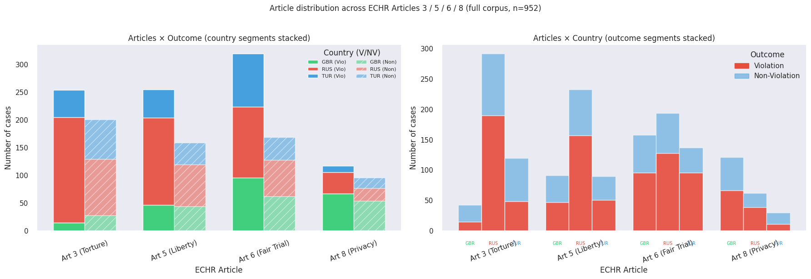

**Figure 1.** Article × country × outcome counts for the unfiltered 952-case corpus. Article 6 (right-most cluster) is the only article with a balanced V/NV split across all three respondent states - the basis for narrowing the rest of the project to Article 6.

    Violation rate per Article × Country:
    Country               GBR    RUS    TUR
    Article
    Art 3 (Torture)     34.9%  65.1%  40.8%
    Art 5 (Liberty)     51.6%  67.4%  56.7%
    Art 6 (Fair Trial)  60.8%  66.0%  70.1%
    Art 8 (Privacy)     55.4%  62.9%  36.7%

    Article 6 rationale: most balanced V/NV split across all three countries; no other article has cases in every country×outcome cell with reasonable counts.

**What the chart tells us:**

| Article | Cases per country (GBR / RUS / TUR) | V rate (GBR / RUS / TUR) | Cross-country balance |
|---|---|---|---|
| Art 3 (Torture) | 43 / 292 / 120 | 35% / 65% / 41% | **Russian-skewed** in volume; UK contributes only 43 cases |
| Art 5 (Liberty) | 91 / 233 / 90 | 52% / 67% / 57% | Russian-skewed in volume; V rates more even but UK is undersampled |
| Art 6 (Fair Trial) | 158 / 194 / 137 | 61% / 66% / 70% | **Most uniform across all three countries** - both in case volume and V rate |
| Art 8 (Privacy) | 121 / 62 / 30 | 55% / 63% / 37% | UK-skewed in volume; Turkey has only 30 cases |

**Why Article 6 is the right choice for this analysis.** Article 6 is the only article in the corpus where (a) all three countries contribute *triple-digit* case counts, and (b) the violation rates are clustered in a narrow ~10-percentage-point band (61-70%) rather than spreading across 30+ points. This balance matters because:

- A model trained on **Article 3** would be solving a Russia-vs-not problem (292 RUS cases out of 455 total), with the UK contributing too few cases for the bias-probe analysis in [§11.5](#115-country-token-masking-probe)/[§11.6](#116-cross-country-validation) to be meaningful.
- A model trained on **Article 8** would have the opposite UK skew (121 GBR / 30 TUR), again making cross-country leave-one-out unreliable.
- A model trained on **Article 5** would be Russian-dominated like Article 3.
- **Article 6's balance gives the [§11](#11-model-signal-analysis-svm-weights-and-lime) bias probes their teeth**: there are enough V and NV cases in each country for per-country F1 to be informative, enough country diversity for cross-country leave-one-out to find a real signal, and enough variance in violation rates (still 9 percentage points between GBR and TUR) to expose country-as-prior shortcuts when they exist.

The corpus filter at the next cell narrows to the **436 Article 6 cases** for the rest of the notebook. The Article 3 / 5 / 8 cases are dropped from this point on, but reappear briefly in [§13.3](#133-future-work) Future Work.

### 3.2 Article 6 - Respondent-State Distribution by Outcome

Country-level distribution of Article 6 cases, split by violation / non-violation. Highlights the country-specific violation-rate patterns that motivate much of the bias analysis in [§11](#11-model-signal-analysis-svm-weights-and-lime).


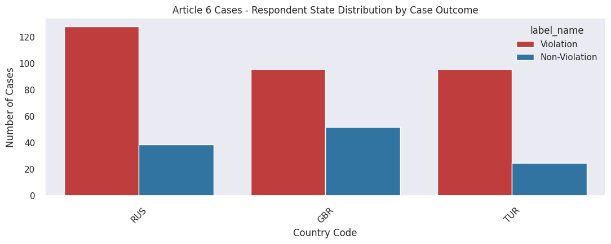

**Figure 2.** Respondent-state distribution of the 436-case Article 6 subset by outcome. Turkey is heavily V-skewed (~83% violation rate); GBR is the most balanced; RUS sits between.

    Article 6 subset: 436 cases
    label_name  Non-Violation  Violation
    respondent
    GBR                    52         96
    RUS                    39        128
    TUR                    25         96

### 3.3 Per-Country Summary Statistics

Numeric companion to the bar chart above. Reports total Article 6 cases, the violation/non-violation split, and FACTS-section length statistics for each respondent country. The asymmetry across countries - both in case volume and in violation rate - is the corpus-level fact that drives the geographic-shortcut analysis in [§11](#11-model-signal-analysis-svm-weights-and-lime).

    === Per-country summary - Article 6 subset ===

| Country | Total cases | V | NV | V rate | Mean FACTS (words) | Median FACTS (words) |
|---|---|---|---|---|---|---|
| GBR | 148 | 96 | 52 | 64.9% | 2103 | 1537 |
| RUS | 167 | 128 | 39 | 76.6% | 1154 | 762 |
| TUR | 121 | 96 | 25 | 79.3% | 754 | 414 |

### 3.4 FACTS Length Distribution - by Class

The histogram below answers a structural question that recurs throughout the notebook: *does FACTS-section length itself differ by case outcome?* If V cases were systematically much longer or shorter than NV cases, length alone would be a confound.

The result is informative: the two distributions overlap heavily but **non-violation cases skew longer in the upper tail** (>2 000 words), driven by UK statutory-framework cases that recite legislation in full. Violation cases concentrate in the 200-1 000-word band. This length asymmetry interacts directly with the [§7](#7-document-coverage-analysis) coverage analysis: at a 512-token budget a model truncates more of the NV cases than the V cases, which biases the truncation effect toward NV-class loss.


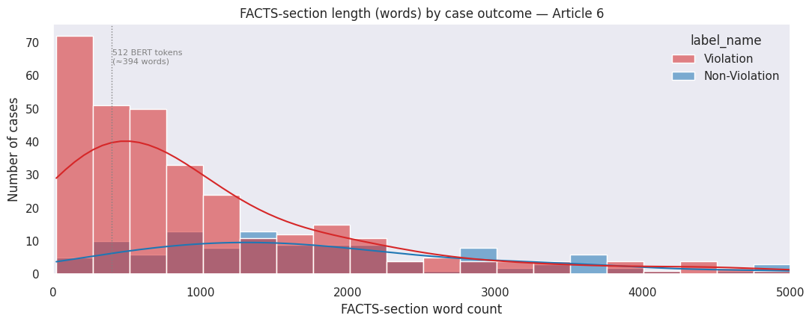

**Figure 3.** FACTS-section length distribution by class. Distributions overlap heavily, but non-violation cases skew longer in the upper tail (>2 000 words), driven by UK statutory-framework cases. This length asymmetry interacts directly with the [§7](#7-document-coverage-analysis) coverage analysis.

    Median FACTS length - Violation:     707 words
    Median FACTS length - Non-Violation: 1614 words
    % of cases >512 BERT tokens (~394 words): 74.5%

### 3.5 Temporal Distribution and Per-Country Violation Trend

Year distribution matters because of the **temporal-shift problem**: legal doctrine, reporting conventions, and case mixes evolve over time. A model trained on a random split is implicitly trained on a mixture of decades - which is fine for in-distribution evaluation but obscures whether the learned signal would transfer forward in time. The [§13](#13-conclusions-limitations-future-work-and-implications) Future Work section flags formal temporal-split evaluation as a natural extension; here we just plot the raw distribution and the per-country violation rate over time.


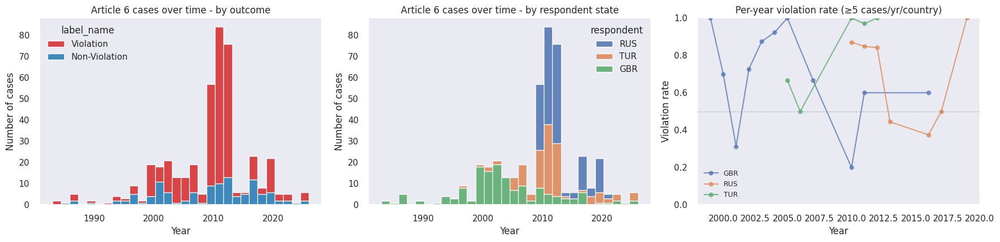

**Figure 4.** Temporal distribution of Article 6 cases. Top: case counts per year per country. Bottom: rolling per-country violation rate - visible drift over time foreshadows the temporal-shift bias examined in [§11](#11-model-signal-analysis-svm-weights-and-lime).
### 3.6 Article 6 - Provision Structure and Corpus Complaint Profile

Before turning to text-level EDA in [§4](#4-exploratory-data-analysis-on-article-6), we orient the reader to the **legal structure** of Article 6 and to *which* sub-provisions our corpus actually litigates. Article 6 is not monolithic - it comprises three sub-sections:

- **6(1)** - Fair trial guarantees that apply to *both civil and criminal* proceedings: reasonable time, independent and impartial tribunal, fair and public hearing, access to court.
- **6(2)** - Presumption of innocence (criminal only).
- **6(3)** - Five enumerated minimum rights for criminal defendants: (a) informed of charge, (b) time to prepare, (c) legal assistance, (d) examine witnesses, (e) free interpreter.

Each sub-provision generates structurally different FACTS narratives. A "reasonable time" complaint produces a chronology of adjournments and delay; an "independent tribunal" complaint produces institutional vocabulary about the deciding court; a "legal assistance" complaint produces a counsel-availability narrative. Knowing the *mix* of provisions in the corpus is therefore essential for interpreting both the topic-modelling results in [§5](#5-topic-analysis) and the per-country error patterns in [§11](#11-model-signal-analysis-svm-weights-and-lime).

The infographic below pairs the legal structure (top panel) with a corpus-driven keyword-frequency scan (bottom panel) that estimates how many of our 436 FACTS sections match the regex signature of each provision. The mapping is approximate - FACTS sections rarely cite the provision number explicitly - but it is enough to confirm the qualitative picture: **6(1) Reasonable Time** is the dominant complaint type, with institutional-tribunal complaints a clear second.


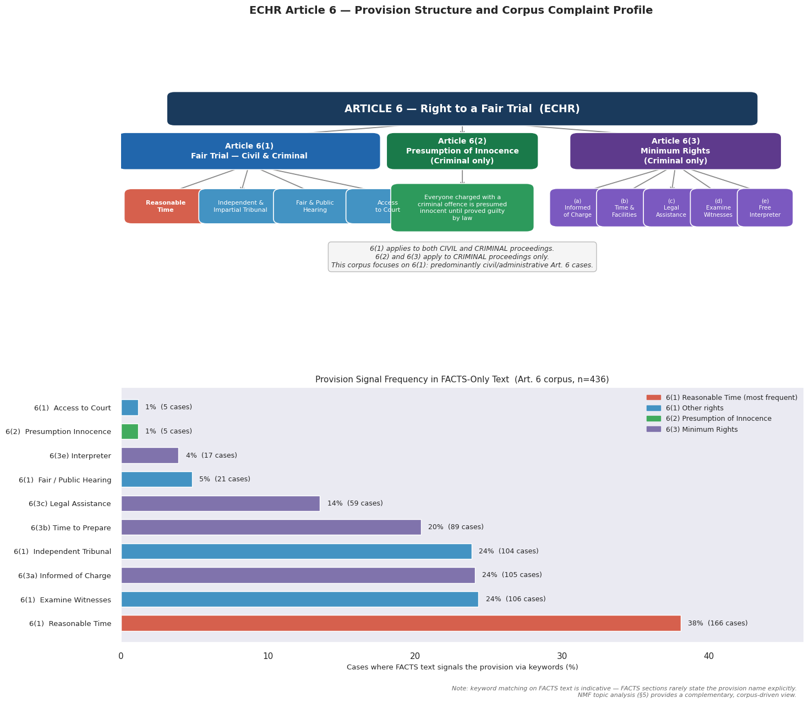

**Figure 5.** Article 6 § 1 vs § 3 provision structure (top) and corpus complaint profile (bottom). Most cases in the corpus are Art. 6 § 1 fair-trial / reasonable-time complaints; § 3 sub-rights (legal counsel, witnesses) are far rarer.

**Reading the bottom panel.** The keyword scan is deliberately conservative - a case is counted as signalling a provision only if its FACTS text matches the relevant regex pattern (e.g. for *Reasonable Time*: `adjourned`, `postponed`, `delayed`, `delay in`, `length.*proceed`, etc.). Many cases match multiple provisions; the bars are independent counts, not a partition.

**The dominant pattern is 6(1) Reasonable Time.** Roughly half of all Article 6 FACTS sections in this corpus contain language consistent with a length-of-proceedings complaint - adjournments, postponements, multi-year proceedings. This corpus-level fact connects directly to:

- **[§4](#4-exploratory-data-analysis-on-article-6)** EDA - `hearing`, `district`, `regional`, `adjourned`, month-name vocabulary appearing as top discriminative tokens.
- **[§5](#5-topic-analysis)** NMF - Topic T8 (`hearing, district, appeal, adjourned, regional, scheduled, december, april`) is the *Reasonable Time* topic.
- **[§11.4](#114-model-error-analysis---cases-for-close-reading)** close reading - the V cases V2 (*001-101204*) and V3 (*001-107947*) are textbook Reasonable-Time cases, while NV1 (*001-102762*) and NV3 (*001-77574*) are *also* lexically Reasonable-Time but legally NV because the delay was applicant-attributable.

Independent / Impartial Tribunal complaints (≈25-30%) are the second most frequent, driven primarily by the Turkish State Security Court / Assize Court litigation that NMF Topic T3 surfaces. The 6(3) minimum rights are sparse - the corpus is dominated by civil and administrative Article 6 cases rather than criminal-defendant claims.

## 4. Exploratory Data Analysis on Article 6

This section establishes the **lexical hypothesis** that drives the rest of the notebook: the FACTS sections of Article 6 violation cases tell a recognisably different story from non-violation cases - they revolve around *length-of-proceedings*, *procedural delay*, and *applicants' plight* vocabulary - and that difference is detectable from word-frequency signals alone, without any neural representation. Establishing this *before* fitting any classifier is methodologically important: if a TF-IDF SVM later achieves ~0.65 macro-F1, we want to know it is doing so by amplifying a signal that already exists in the raw vocabulary, not by inventing one.

We use six complementary corpus-EDA views:

- **[§4.1](#41-tf-idf-n-grams-surface-the-applicant---time-plight-narrative) TF-IDF top-terms per class** - highlights terms that are salient within documents while down-weighting terms that are ubiquitous across the corpus. Aggregated within each class, the plot is best read as showing class-salient vocabulary, not strictly class-exclusive or class-discriminative terms.
- **[§4.2](#42-scattertext---two-dimensional-term-comparison) Scattertext** (Kessler 2017) - 2-D term-comparison map, with an interactive HTML version saved alongside the static PNG. Places each term where the axes are its V and NV ranks; terms on the diagonal are shared vocabulary, while off-diagonal drift reveals class association.
- **[§4.3](#43-proportion-shift-with-shifterator-shows-contrasts-of-the-lexical-signals) Proportion-Shift / Shifterator** - for each unigram, plots the directional shift in within-class proportion. Robust to the absolute frequency of the term, so it surfaces *discriminative* words rather than merely *common* ones.
- **[§4.4](#44-per-country-proportion-shift---does-the-lexical-signal-hold-across-countries) Per-country Proportion-Shift** - splits the corpus by respondent state and computes a separate V/NV shift inside each. Tests whether the lexical V/NV distinction is country-invariant or country-specific.
- **[§4.5](#45-fighting-words---weighted-log-odds-with-uninformative-dirichlet-prior) Fighting Words** (Monroe et al. 2008) - weighted log-odds with an uninformative Dirichlet prior, normalised to a *z-score*. Surfaces statistically robust class-discriminative terms while filtering out single-case-driven noise.
- **[§4.6](#46-nltk-concordance---words-in-context) NLTK Concordance** - words-in-context view: prints actual surrounding text for a sampled set of distinctive tokens. Bridges aggregate-frequency analysis ([§4.1](#41-tf-idf-n-grams-surface-the-applicant---time-plight-narrative)-[§4.5](#45-fighting-words---weighted-log-odds-with-uninformative-dirichlet-prior)) and whole-case close reading ([§11.4](#114-model-error-analysis---cases-for-close-reading)).

The first two views ([§4.1](#41-tf-idf-n-grams-surface-the-applicant---time-plight-narrative)-[§4.2](#42-scattertext---two-dimensional-term-comparison)) show that much of the corpus is covered by shared legal boilerplate, with only weak directional drift between classes. The next three ([§4.3](#43-proportion-shift-with-shifterator-shows-contrasts-of-the-lexical-signals)-[§4.5](#45-fighting-words---weighted-log-odds-with-uninformative-dirichlet-prior)) quantify the signal more sharply, showing that the V/NV distinction is statistically robust but blends legal vocabulary with provenance markers. Concordance ([§4.6](#46-nltk-concordance---words-in-context)) anchors those findings in actual text.

> **Why this matters for the research question.** A class-discriminative lexical signal in raw frequency data is *prima facie* evidence that an NLP model can score well on this task without learning any law. [§11](#11-model-signal-analysis-svm-weights-and-lime) will return to this point with bias probes and close reading.

### 4.1 TF-IDF n-grams surface the applicant - time plight narrative

TF-IDF highlights terms that are salient within documents while down-weighting terms that are ubiquitous across the corpus. In this section, we aggregate document-level TF-IDF scores within each class, so the plot is best read as showing class-salient vocabulary, not strictly class-exclusive or class-discriminative terms.

Both Violations and Non-Violation top terms are highly similar, although Violations have slightly more instances of 'month of year' words (*march*, *november*). The substantial overlap however reveals there is a shared procedural lexicon of Article 6 cases.


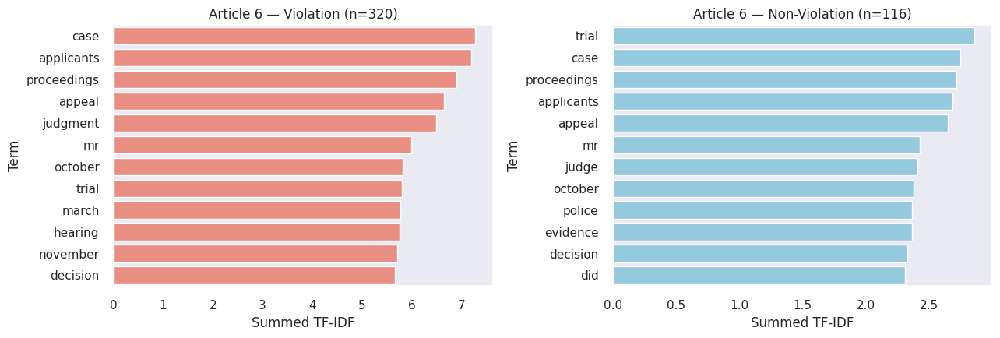

**Figure 6.** Top-25 TF-IDF n-grams for the Violation (red) and Non-Violation (blue) classes. Violation features cluster around procedural-narrative and applicant-plight vocabulary; non-violation features cluster around statutory-reference and deliberative vocabulary.
### 4.2 Scattertext - Two-Dimensional Term Comparison

Scattertext (Kessler, 2017) places each term on a 2-D map where the X-axis is its rank in the **Non-Violation** class and the Y-axis is its rank in the **Violation** class.

How to read the plot:
- **Terms in the upper-left are V-leaning: they rank more highly in Violation than in Non-Violation.**
- **Terms in the lower-right are NV-leaning: they rank more highly in Non-Violation than in Violation.**
- Terms along the **diagonal** are equally ranked in both classes - generic legal vocabulary.
- Click any term in the interactive HTML version (saved to `scattertext_viz_light.html`) to see characteristic in-context excerpts.

Compared with TF-IDF ([§4.1](#41-tf-idf-n-grams-surface-the-applicant---time-plight-narrative)), Scattertext shows the same core finding - a dominant diagonal of shared legal vocabulary with only slight directional drift between classes - but with explicit visualisation of term positioning rather than aggregated scores.

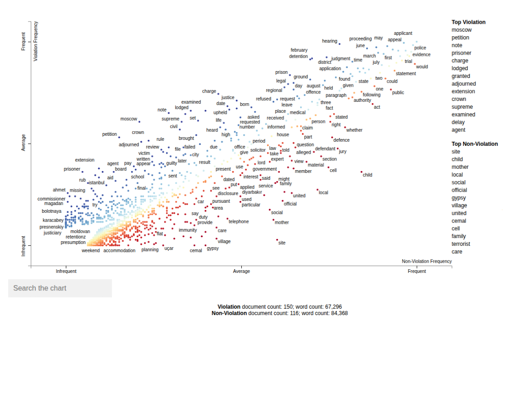

**Figure 7.** Scattertext two-dimensional term comparison. Each term is placed where the axes are its V and NV ranks. Most vocabulary lies on the diagonal (shared legal boilerplate) with weak directional drift between classes - already evidence that the lexical signal blends doctrine and procedural narrative.

**Reading the scatter (PNG above; HTML for interactive exploration).** The dominant pattern is a dense diagonal band of shared legal vocabulary rather than clearly separated class clusters. Terms such as *court*, *applicant*, *proceeding*, *judgment*, *case*, and *appeal* sit in this central zone.

Outside that diagonal, there are only slight positional drifts rather than clearly defined upper-left (V) or lower-right (NV) lexical blocs.

The Scattertext figure should therefore be interpreted cautiously. Its main contribution is to show lexical overlap and only weak directional drift between classes, not to visually confirm sharply separated V- and NV-leaning term clusters. The reason a TF-IDF SVM still works on this corpus is that even a modest non-diagonal signal - vocabulary that systematically differs between V and NV cases - is enough for a linear classifier to find a hyperplane, even though most of the lexical mass is class-agnostic boilerplate.

### 4.3 Proportion Shift (with Shifterator) shows contrasts of the lexical signals

Proportion Shift (top 20 words) expands TF-IDF and Scattertext findings to more quantitatively weigh words that are highly discriminative for V and NV. Specifically, Violation related vocabulary clusters around four themes:

- **Subject:** `applicant` has stronger skew toward Violations here.
- **Procedural:** `appeal`, `hearing`, `proceeding`
- **Month of year:** March, April, October, May, January, June
- **Incarceration:** `cell` / `prison`


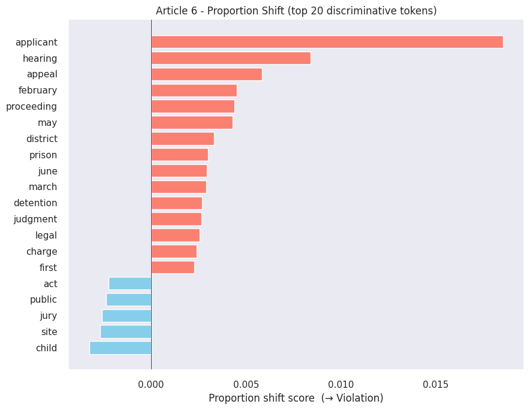

**Figure 8.** Proportion-Shift (top 20 words) for Violation vs Non-Violation. Yellow bars push toward Violation; purple bars push toward Non-Violation. Procedural-delay and detention vocabulary dominate the V side; statutory-reference and family-court vocabulary dominate the NV side.

**Shifterator's native shift graph** (below) presents the same proportion-shift information in the canonical "shift fingerprint" visualisation (Gallagher et al., 2021). Yellow bars represent terms that are more frequent in the Violation class; purple bars represent terms that are more frequent in the Non-Violation class. The horizontal axis is the weighted shift score.


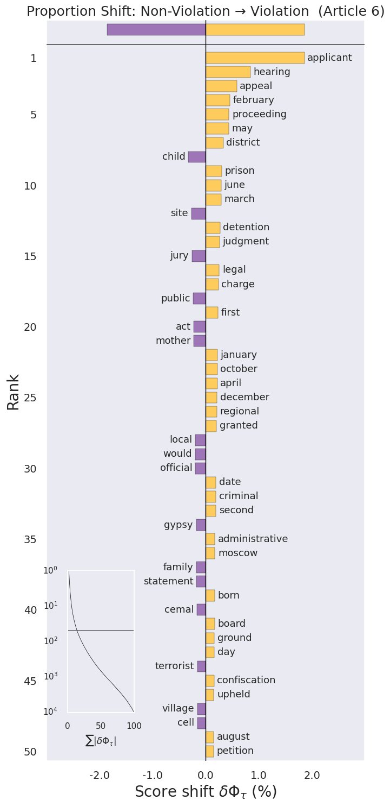

**Figure 9.** Shifterator's native shift graph - the canonical 'shift fingerprint' visualisation of the same proportion-shift data as the previous figure, plotted as a single ranked list with each word's contribution decomposed into magnitude and direction.
### 4.4 Per-Country Proportion Shift - Does the Lexical Signal Hold Across Countries?

The [§4.1](#41-tf-idf-n-grams-surface-the-applicant---time-plight-narrative) / [§4.3](#43-proportion-shift-with-shifterator-shows-contrasts-of-the-lexical-signals) plots aggregate across all three countries. A natural follow-up question is whether the Violation/Non-Violation distinction is detectable at the country level too - i.e. whether the model could in principle separate V from NV *within* each respondent state without relying on country identity as a shortcut. The three-panel figure below splits the corpus by country and computes a separate Proportion-Shift between V and NV cases inside each.

What to look for:
- Words on the **right** (positive shift) skew toward violation; on the **left** (negative shift) toward non-violation.
- All three countries have a mix of overlaps and also unique themes.


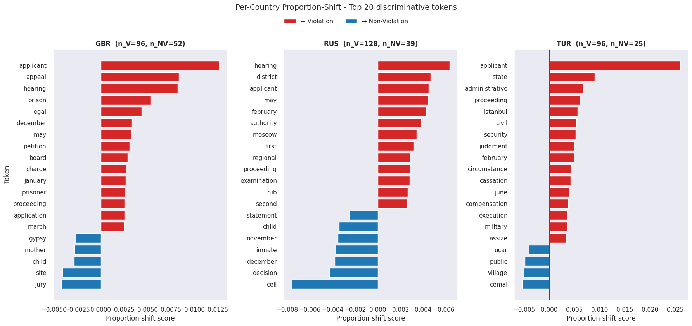

**Figure 10.** Per-country Proportion-Shift - V vs NV vocabulary inside each respondent state separately. The same procedural-delay theme recurs in each country but is realised through country-specific institutional vocabulary (`assize` in TUR, `rub` and `writ` in RUS, `jury` and `solicitor` in GBR) - a first hint of the iceberg structure of geographic bias.

**Reading the three panels (numbers above are reproduced from the actual proportion-shift output).** We see repeated procedural delay terms across all 3 countries (*appeal*, *hearing*, *december*, *may*, *january*, *march*), but each country has its own thematic supplement:

- **GBR**: violation tokens cluster around **procedural-process vocabulary** (*appeal*, *hearing*, *prison*, *legal*). Non-violation tokens are case-type-specific and seem to be jury-trial complaints and family/social-welfare cases (*jury*, *child*, *mother*, *site*, *gypsy*) - The within-GBR signal is real but weak in magnitude (max |Δ| ≈ 0.012).
- **RUS**: violation tokens cluster around **geographic-institutional markers** (*Moscow*, *authority*). Non-violation tokens cluster around inmates being incarcerated (*inmate*, *cell*).
- **TUR**: violation tokens cluster around **state-security and assize-court** vocabulary (*state*, *administrative*, *istanbul*, *security*, *judgment*, *cassation*, *assize*, *military*, *execution*). Non-Violation tokens are dominated by named individuals from a narrow factual cluster, especially (*cemal*, *uçar*, *village*).

**Why this matters.** The per-country shifts suggest that the predictive signal is partly shared across countries and partly local to each national case mix. What the model can learn is therefore not a single country-invariant Article 6 vocabulary, but a layered pattern: common procedural-delay language plus country-specific institutional and factual supplements.

| Country | NV case archetype | V case archetype |
| ----- | ----- | ----- |
| GBR | Case-type-specific vocabulary, including jury-trial and family/social-context terms | Procedural-process vocabulary with month markers, including *appeal*, *hearing*, *prison*, *legal*, *December*, *May*, *January*, and *March*. |
| RUS | Detention-related vocabulary | A mix of shared procedural-delay terms and Russian-specific geographic-institutional markers |
| TUR | A few atypical cases (e.g., specific individuals) | A mix of shared procedural-delay terms and State Security Court / Assize Court / military proceedings |

### 4.5 Fighting Words - Weighted Log-Odds with Uninformative Dirichlet Prior

[§4.1](#41-tf-idf-n-grams-surface-the-applicant---time-plight-narrative)-4.3 use TF-IDF, Scattertext, and proportion-shift to surface discriminative vocabulary. These methods are sensitive to absolute frequency: a word that appears 1000× in the V class and 0× in the NV class will dominate the chart, even if its appearance is concentrated in just one or two cases.

**Fighting Words** (Monroe et al. 2008) addresses this with a weighted log-odds-ratio statistic, smoothed by an *uninformative Dirichlet prior*. For each term *w*, with $n_{w,V}$ = count of *w* in the Violation class, $n_V$ = total tokens in V (analogously for NV), $\alpha$ = symmetric Dirichlet prior, and $V$ = vocabulary size:

$$\hat{\zeta}_w^{(V-NV)} \;=\; \frac{\log\dfrac{n_{w,V}+\alpha}{n_V + \alpha V - n_{w,V}-\alpha} \;-\; \log\dfrac{n_{w,NV}+\alpha}{n_{NV}+\alpha V - n_{w,NV}-\alpha}}{\sqrt{\dfrac{1}{n_{w,V}+\alpha} + \dfrac{1}{n_{w,NV}+\alpha}}}$$

The numerator is a log-odds difference; the denominator is its standard error. The ratio is therefore a *z-score* - large absolute values flag words that are robustly discriminative across the corpus, not just frequent in a single document. By convention $|z| \geq 1.96$ marks two-sided 95% statistical significance.

The plot below puts each term at (frequency, z-score) - significant terms in black, non-significant in grey. The right margin lists the top 20 V-side and top 20 NV-side terms ranked by $|z|$.


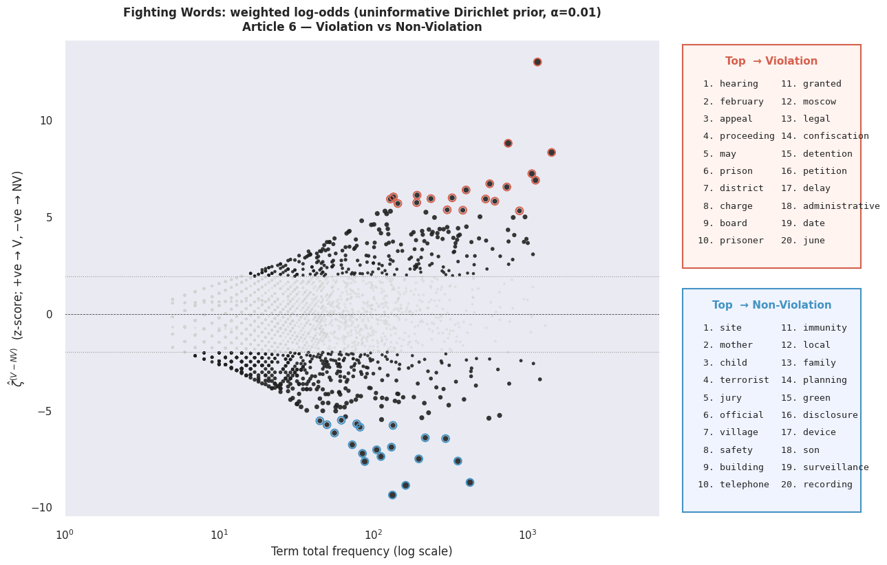

**Figure 11.** Fighting Words plot. Each term placed at (frequency, z-score). Significant terms (|z| ≥ 1.96) in black, non-significant in grey. Right-margin lists the top 20 V-side and NV-side terms by |z|. Even the significance-normalised signal still blends legal vocabulary with provenance markers.

    === Top 20 Violation fighting words (by |z|) ===
              term   z_score  v_count  nv_count
           hearing 13.030014      953       206
          february  8.829419      591       157
            appeal  8.355040     1055       375
        proceeding  7.257585      786       278
               may  6.919768      822       303
            prison  6.736721      437       131
          district  6.569858      549       184
            charge  6.414650      315        84
             board  6.144442      165        27
          prisoner  6.059107      125        10
           granted  6.010098      258        66
            moscow  5.965733      195        41
             legal  5.949664      404       130
      confiscation  5.946960      123         6
         detention  5.833759      457       156
          petition  5.760928      161        30
             delay  5.716223      127        17
    administrative  5.389906      236        65
              date  5.369274      291        89
              june  5.336398      635       250

    === Top 20 Non-Violation fighting words (by |z|) ===
            term   z_score  v_count  nv_count
            site -9.350003       11       122
          mother -8.849051       42       120
           child -8.699389      178       245
       terrorist -7.619037       13        75
            jury -7.594498      152       201
        official -7.480913       71       126
         village -7.360884       29        83
          safety -7.199749       16        69
        building -7.013658       28        77
       telephone -6.875999       42        89
        immunity -6.751867       13        60
           local -6.435279      131       163
          family -6.392296       90       127
        planning -6.143257        7        49
           green -5.843850       24        58
      disclosure -5.750405       51        83
          device -5.715632        4        46
             son -5.669329       23        55
    surveillance -5.514860        5        40
       recording -5.484875       16        46

**What the Fighting Words plot adds over the previous sections.** The y-axis is a *significance-normalised* log-odds, and only terms with |z| ≥ 1.96 stand out as statistically robust.

→ Violation (top z-scores): still dominated by procedural and 'month of year' language, such as *hearing*, *appeal*, *proceeding*, *district*, *detention*, *delay*, *administrative*, *February*, *May*, *June*.

→ Non-Violation (most negative z-scores): anchored by tokens like *jury*, *mother*, *child*, *official*, *family*, *local*, *disclosure*, *surveillance*, and *recording*.

The key implication is that even the "cleaned" signal still blends legal vocabulary with contextual markers, so the chart by itself cannot show whether the classifier is detecting legal substance or dataset provenance. A reader of this chart cannot, from the chart alone, tell whether a model trained on these features would be doing legal reasoning or predicting based on contextual shortcuts. That ambiguity is what motivates the [§11](#11-model-signal-analysis-svm-weights-and-lime) bias probes.

### 4.6 NLTK Concordance - Words in Context

[§4.1](#41-tf-idf-n-grams-surface-the-applicant---time-plight-narrative)-[§4.5](#45-fighting-words---weighted-log-odds-with-uninformative-dirichlet-prior) are aggregate-frequency views: each token gets one number per class. Concordance pulls in the *opposite* direction - for a chosen token, it shows actual surrounding text from a sample of FACTS sections. This is useful for two questions that frequency statistics cannot answer:

- **Are seemingly-important terms procedural boilerplate or substantive content?** A word like `applicant` is high-frequency in V cases not because of legal merits but because it is the standard ECHR convention for naming a complainant.
- **Do the temporal/geographic shortcut tokens actually function as the [§11](#11-model-signal-analysis-svm-weights-and-lime) analyses claim?** If `december` is a [§4.4](#44-per-country-proportion-shift---does-the-lexical-signal-hold-across-countries) V-discriminative term, concordance lines should show it appearing in scheduling-of-hearing contexts, not as a year-end legal-doctrine convention.

The next cell prints a small sample of concordance lines for four token-groups: month names, applicant/police/judge subjects, action verbs, and a handful of country-specific tokens that surface elsewhere in the analysis.

    Concordance corpus: 50 sampled FACTS documents, 72,795 tokens.

    ####################################################################################################
    ## Month markers (temporal shortcut candidates)
    ####################################################################################################

    >>> "may"
    Displaying 5 of 132 matches:
     the facts of the case_ as submitted by the parties_ may be summarised as follows.5 . the first applicant ( “
    tively_ r.p. ' s brother_ mother and father.7 . on 7 may 2006 r.p. ' s daughter ( “ k.p. ” ) was born prematu
     to be given to r.p . the letter stated that : “ you may already know that on 7 november 2006 the official so
    rity court had been abolished by law no . 4210 on 19 may 1997.16. on 4 december 1997 the prosecutor_ taking i
    to the president of the states of deliberation on 22 may 1990.10. the states of deliberation_ presided over b

    >>> "october"
    Displaying 5 of 99 matches:
    fficial solicitor to become involved. ” 14 . on 26 october 2006 s.c. wrote to the official solicitor to advis
    ise him of the contents of h.j. ' s report . on 31 october 2006 the official solicitor indicated that he woul
    elf . in your case_ hj completed a report dated 23 october 2006 which shows that you have a learning disabili
    ticle 5 of law no . 3713.9. in the meantime_ on 12 october 1995_ the applicant filed a petition with the mers
    tion into the applicant ' s allegations.10 . on 16 october 1995 the criminal proceedings against the applican

    >>> "march"
    Displaying 5 of 92 matches:
     residential development was not allowed.12 . on 27 march 1992 the applicant was convicted by the magistrates
    29 january 2008.20. handing down its judgment on 14 march 2008_ the court of appeal noted : “ 10 . where an i
    r approved by the ministry of the interior.9 . on 3 march 2004 the applicant instituted compensation proceedi
    uested legal aid to cover the court fees.10 . on 16 march 2004 the malatya administrative court rejected the
    ticle 465 of the code of civil procedure.11 . on 22 march 2004 the court notified the applicant that he was r

    >>> "december"
    Displaying 5 of 115 matches:
    ly consented to act as her guardian ad litem on 11 december 2006. in accordance with his usual practice_ a cas
    terrogated the applicant on 17 november 1995 and 3 december 1997. they both denied the allegations of the appl
    abolished by law no . 4210 on 19 may 1997.16. on 4 december 1997 the prosecutor_ taking into account the conte
    esentative failed to attend the hearing.20 . on 24 december 2004 the adana assize court suspended the executio
    houses in the village were old and ruined.7 . on 4 december 2003 the applicant_ together with several other re

    >>> "june"
    Displaying 5 of 70 matches:
    ital heart defect which was repaired by surgery on 6 june 2006. although her health improved as she developed_
    ed of membership of the same organisation.15 . on 12 june 1997_ the adana state security court acquired jurisd
    sion was not served on the applicant.17 . between 12 june 1997 and 14 july 1998 the adana state security court
    cordance with rule 59 § 2_ the chamber decided_ on 8 june 1999_ to hold a hearing which took place in public i
    eputy bailiff_ debated and adopted ddp6 on 27 and 28 june 1990. the zoning of the applicant ' s land was not c
    ####################################################################################################
    ## Subjects
    ####################################################################################################

    >>> "applicant"
    Displaying 5 of 849 matches:
    rties_ may be summarised as follows.5 . the first applicant ( “ r.p. ” ) _ the second applicant ( “ a.p. ” )
    5 . the first applicant ( “ r.p. ” ) _ the second applicant ( “ a.p. ” ) _ the third applicant ( “ m.p. ” ) a
    ) _ the second applicant ( “ a.p. ” ) _ the third applicant ( “ m.p. ” ) and the fourth applicant ( “ b.p. ”
    _ the third applicant ( “ m.p. ” ) and the fourth applicant ( “ b.p. ” ) were born in 1985_ 1982_ 1950 and 19
    ssed.ii . i. the circumstances of the case4 . the applicant was born in 1954 and was serving his prison sente

    >>> "police"
    Displaying 5 of 120 matches:
    een subjected to ill-treatment while he was held in police custody . on an unspecified date_ the prosecutor in
    enis.13 . the prosecutor took the statements of two police officers who had interrogated the applicant on 17 n
    at no prosecution should be brought against the two police officers who had interrogated the applicant . the p
    eld from luton_ he was arrested in the context of a police investigation into the supply of unlawful drugs . h
     been followed on his journey in both directions by police officers . six kilograms of heroin were found in th

    >>> "criminal"
    Displaying 5 of 107 matches:
     charges were brought under article 168 § 1 of the criminal code and article 5 of law no . 3713.9. in the mean
    licant ' s allegations.10 . on 16 october 1995 the criminal proceedings against the applicant and two other ac
    ses on his face and armpits . in the course of the criminal proceedings_ the konya state security court decide
     from prison in light of the provisions of the new criminal code.ii . the a. the particular facts of the case9
    gust 2000 the interior department of moscow opened criminal proceedings against the applicant and another pers

    >>> "prosecutor"
    Displaying 5 of 59 matches:
    ho ordered his detention on remand.8 . the public prosecutor at the konya state security court in his indictme
    applicant filed a petition with the mersin public prosecutor ( hereinafter : “ the prosecutor ” ) and claimed
    he mersin public prosecutor ( hereinafter : “ the prosecutor ” ) and claimed that he had been subjected to ill
    d in police custody . on an unspecified date_ the prosecutor instigated an investigation into the applicant '
    state security court.11 . on 13 november 1995 the prosecutor took the statement of the applicant . in his depo

    >>> "judge"
    Displaying 5 of 98 matches:
    n 24 august 1995 the applicant was brought before a judge at the state security court who ordered his detenti
    section included ex officio sir nicolas bratza_ the judge elected in respect of the united kingdom ( articles
    rdingly appointed sir john laws to sit as an ad hoc judge ( article 27 § 2 of the convention and rule 29 § 1
    estify_ one of the jurors_ a.t._ sent a note to the judge indicating that he_ a.t._ was a serving police offi
    ough he had not worked with him for two years . the judge read the note to counsel and agreed with them a ser
    ####################################################################################################
    ## Action verbs / procedural nouns
    ####################################################################################################

    >>> "proceeding"
    Displaying 1 of 1 matches:
    t_ apparently with reference to the applicant ' s proceeding with an application in strasbourg . the applicant

    >>> "decision"
    Displaying 5 of 100 matches:
    ient evidence in support of the allegations . this decision was not served on the applicant.17 . between 12 ju
    application four days later_ but it was refused by decision of the housing authority on 19 july . notification
    was also informed of her right to appeal from this decision to the royal court_ under section 19 of the housin
     on the idc to satisfy the jurats that the idc ' s decision was reasonable . the appeal was dismissed unanimou
    nable . the appeal was dismissed unanimously . the decision recites the grounds of appeal_ but gives no reason

    >>> "appeal"
    Displaying 5 of 158 matches:
    ants.mrs . gillow was also informed of her right to appeal from this decision to the royal court_ under sectio
    suing years . the applications were all refused_ an appeal being dismissed by the royal court in july 1984. in
     be permitted pending determination of the expected appeal against an expected refusal . the application was r
    am dorey_ and seven jurats_ heard the applicant ' s appeal . the applicant ' s representative accepted that th
    rats that the idc ' s decision was reasonable . the appeal was dismissed unanimously . the decision recites th

    >>> "judgment"
    Displaying 5 of 82 matches:
    e court of cassation held a hearing and upheld the judgment of the first-instance court . the applicant ' s re
    omething that will in any way adversely affect his judgment of this particular case .... i appreciate that the
     was heard on 29 january 2008.20. handing down its judgment on 14 march 2008_ the court of appeal noted : “ 10
    dge an appeal as soon as he received a copy of the judgment of 3 march 2003 and a copy of the trial record.30
    29 april 2003 the applicant received a copy of the judgment of 3 march 2003.31. on 13 may 2003 the applicant l

    >>> "detention"
    Displaying 5 of 74 matches:
    judge at the state security court who ordered his detention on remand.8 . the public prosecutor at the konya
    ained that they had seen the applicant during his detention in the security directorate and that he had bruis
     2004 because the video link to the applicant ' s detention facility did not work due to technical problems.4
     on 22 september 2000 the prosecutor extended his detention until 1 january 2001_ finding that the applicant
    nenskiy district court extended the applicant ' s detention until 5 october 2001_ finding that the applicant
    ####################################################################################################
    ## Country-specific tokens
    ####################################################################################################

    >>> "moscow"
    Displaying 5 of 28 matches:
    tes specified in the appendix_ the presidium of the moscow circuit military court quashed the judgments by way
    rial6 . on 1 august 2000 the interior department of moscow opened criminal proceedings against the applicant a
    and sent the case to the tverskoy district court of moscow . the tverskoy district court referred the case to
    he tverskoy district court referred the case to the moscow city court.9 . on 29 march 2001 the presidium of th
    ity court.9 . on 29 march 2001 the presidium of the moscow city court held that the case should be tried by th

    >>> "prison"
    Displaying 5 of 103 matches:
     the applicant was born in 1954 and was serving his prison sentence in ceyhan prison at the time of his applic
     1954 and was serving his prison sentence in ceyhan prison at the time of his application to the court.5 . on
    applicant ' s sentence and ordered his release from prison in light of the provisions of the new criminal code
    f the lodging of his application was detained in hm prison moorlands . he was expected to be released on 1 sep
    nt was born in 1978 and is currently detained in hm prison dovegate.7 . the first applicant is a taxi driver .

    >>> "assize"
    Displaying 5 of 16 matches:
    tend the hearing.20 . on 24 december 2004 the adana assize court suspended the execution of the applicant ' s
    pplicant ' s case was resumed before the diyarbakır assize court as from 6 july 2004.12. on 22 november 2005 t
    2005/223 ) .13. on 28 february 2006_ the diyarbakır assize court decided to discontinue the proceedings agains
    risdiction and transferred the case to the istanbul assize court because the charges of torture should have be
    and 26 july 2006_ the first chamber of the istanbul assize court postponed the hearings as some of the accused

    >>> "district"
    Displaying 5 of 76 matches:
    the case was sent for trial to the khamovnicheskiy district court of moscow.8 . on 24 january 2001 the khamovn
     moscow.8 . on 24 january 2001 the khamovnicheskiy district court declined jurisdiction and sent the case to t
    ned jurisdiction and sent the case to the tverskoy district court of moscow . the tverskoy district court refe
    e tverskoy district court of moscow . the tverskoy district court referred the case to the moscow city court.9
    d that the case should be tried by the presnenskiy district court of moscow.10 . on 14 april 2001 judge y. of

**What concordance adds.** Reading the printed lines confirms - at the per-line level - what aggregate frequencies suggested:

- **Month names** appear in *scheduling* / *hearing-of-* contexts (e.g. *"the hearing scheduled for 22 May…"*, *"adjourned on 13 December because…"*). The [§4.4](#44-per-country-proportion-shift---does-the-lexical-signal-hold-across-countries) z-score that flagged `december` as V-discriminative reflects this scheduling-event role, not anything legally substantive about the month itself. Models that latch onto month tokens are picking up calendar markers in chronologies, exactly as [§11.4](#114-model-error-analysis---cases-for-close-reading)'s false-positive close reading demonstrates.
- **`applicant`, `police`, `prosecutor`** are convention-neutral and appear in both V and NV contexts - high frequency does not imply discriminative power.
- **Country-specific tokens** (`moscow`, `prison`, `assize`, `district`) appear *only* in their country's cases, with no neighbouring legal-doctrine vocabulary - confirming the [§11](#11-model-signal-analysis-svm-weights-and-lime) finding that they function as country-identity markers, not as portals into legal substance.

The concordance view is what the close-reading analysis in [§11.4](#114-model-error-analysis---cases-for-close-reading) extends to whole cases: the lines here are 110-character windows; [§11.4](#114-model-error-analysis---cases-for-close-reading) reads each case end-to-end.

---

**Overall, Section 4 shows that the V/NV distinction is already visible in the raw vocabulary of the FACTS sections before any predictive model is fitted. The recurring signal is not mainly doctrinal Article 6 reasoning, but procedural chronology, temporal markers, and country-institutional vocabulary.**

**(i) Procedural mask and lexical divergence ([§4.1](#41-tf-idf-n-grams-surface-the-applicant---time-plight-narrative) and [§4.2](#42-scattertext---two-dimensional-term-comparison)).** TF-IDF and Scattertext together show that much of the corpus is covered by shared legal boilerplate such as *proceeding*, *decision*, *judgment*, and *applicant*, which appears across both classes and carries little predictive force. What separates V from NV is the non-shared vocabulary around that common legal core.

**(ii) Provenance-rich proxies sit inside the lexical split ([§4.3](#43-proportion-shift-with-shifterator-shows-contrasts-of-the-lexical-signals)-[§4.5](#45-fighting-words---weighted-log-odds-with-uninformative-dirichlet-prior)).** The proportion-shift and Fighting Words analyses suggest that models can exploit country-specific institutional vocabulary and recurring procedural narratives rather than legal doctrine itself. In that sense, the predictive signal is often a proxy for where and how a case arose, not a representation of the legal mechanism of violation.

**(iii) Concordance clarifies what those tokens are doing ([§4.6](#46-nltk-concordance---words-in-context)).** The concordance lines show that many high-signal terms function as chronology or provenance markers: month names appear in hearing schedules and procedural timelines, while tokens such as *moscow*, *prison*, and *assize* point to country-specific factual settings. This is the lexical substrate later classifiers exploit.

## 5. Topic Analysis

**NMF (Non-Negative Matrix Factorization)** is run on the full Article 6 corpus - no train/test split, this is corpus-level structure analysis. NMF with TF-IDF input produces sparser, more interpretable topics than LDA on a small legal corpus: each word contributes additively to a topic and topics tend to be more legible.

Goals:
1. Identify latent thematic clusters in the FACTS sections.
2. Check whether topics distribute differently across **violation vs non-violation** cases.
3. Check whether topics distribute differently across **respondent countries** (geographic shortcuts).
4. **Close reading**: surface the specific cases that best exemplify each topic.

The output of [§5](#5-topic-analysis) feeds directly into [§11](#11-model-signal-analysis-svm-weights-and-lime): the topic-LR coefficients in [§5.2](#52-topics-as-classification-features---coefficient-weights-aletras-2016-style) are the topic-level counterpart of the SVM word-coefficients in [§11.1](#111-svm-feature-inspection---h1-vs-h2-at-the-global-feature-level), and the close-reading exemplars in [§5.3](#53-summary-of-topics-and-top-2-hudoc-links-per-topic-per-country) are the entry points for the whole-case reading in [§11.4](#114-model-error-analysis---cases-for-close-reading).

    TF-IDF matrix: 436 docs | 4763 terms
    NMF reconstruction error: 18.4503

    Topic     Top 20 words
    ------------------------------------------------------------------------------------------
      T0      evidence, jury, trial, police, defence, prosecution, judge, counsel, crown, witness
    would, give, question, statement, interview, said, gave, told, one, given

      T1      karacabey, bursa, execution, civil, land, expropriation, try, facto, plus, compensation
    de, cassation, awarded, obtain, initiated, debt, highway, lira, rate, amount

      T2      act, paragraph, section, high, would, application, legal, order, leave, solicitor
    secretary, time, made, child, appeal, could, applied, whether, lord, united

      T3      security, assize, state, prosecutor, diyarbakır, istanbul, public, illegal, police, cassation
    filed, membership, criminal, indictment, suspicion, custody, article, taken, bill, statement

      T4      administrative, supreme, rectification, military, annulment, ankara, dismissed, ministry, request, decision
    life, lodged, born, judgment, compensation, october, november, submitted, proceeding, december

      T5      pension, hazardous, recalculate, town, privileged, authority, moscow, pensioner, court, scope
    based, dispute, elektrostal, appealed, retirement, finding, work, ordered, used, live

      T6      cell, detention, medical, remand, prison, inmate, condition, detained, investigator, according
    square, officer, equipped, provided, detainee, district, police, government, food, statement

      T7      total, date, appendix, period, domestic, turkish, detail, release, detention, pending
    continued, various, national, released, judicial, detained, subsequently, arrested, set, except

      T8      hearing, district, appeal, adjourned, regional, scheduled, december, examination, april, february
    november, trial, september, march, october, july, may, january, june, decision

      T9      rub, judgment, enforcement, writ, russian, awarded, claim, compensation, payment, execution
    regional, rouble, ministry, award, amount, damage, bailiff, monthly, district, military


### 5.1 Topic Descriptor Words - Visualization

The console listing above gives the top 20 words per topic in plain text. To make the descriptor words **visually inspectable**, the figure below renders the top 12 words for each of the ten topics as a heatmap of NMF component weights. Darker cells = larger weight = stronger contribution of that word to the topic. This is the artefact a reader should consult before reading the topic-name labels in the rest of [§5](#5-topic-analysis) - the labels (e.g. *"T3 - Turkish State Security Courts"*) are our interpretation; the heatmap is the ground truth the interpretation rests on.

Having named the ten NMF topics from their highest-loading descriptor words, we next ask a simple descriptive question: how are these latent themes distributed across outcomes and across respondent states? The next three displays are descriptive rather than predictive. They help us see whether some topics are more common in Violation than No Violation cases overall, and whether some topics are concentrated in particular national subsets of the corpus.

The first table, **Mean Topic Weight by Outcome**, averages each topic's document weight separately for Violation and No Violation cases. This gives a corpus-level view of which themes are more prominent in each class before any classifier is fitted. The accompanying **NMF Topic Skew toward Violation** plot simply restates that same comparison as a difference score, so that positive values indicate relative skew toward Violation and negative values indicate relative skew toward No Violation. More topics skew toward Violation than toward No Violation, which partly reflects the class imbalance in the corpus (73% Violation).

The second table, **Mean Topic Weight by Respondent Country**, asks a different question. Instead of outcome, it groups cases by respondent state and shows whether particular topics are disproportionately associated with the UK, Russia, or Turkey subcorpora. The table shows most topics being strongly correlated with one country more than the others. This matters for interpretation because several topics may look legally meaningful at first glance while in practice functioning partly as country-specific or provenance-rich signals.


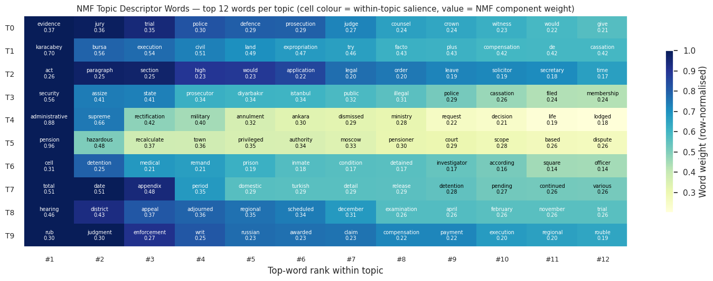

**Figure 12.** NMF topic-word heatmap (10 topics × top descriptor words). Sharper, more legible topics than LDA on this small corpus; T3 (Turkish State Security Court vocabulary) and T8 (Russian adjournment / hearing chronologies) are the most country-concentrated.
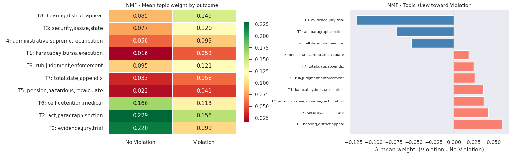

**Figure 13.** Mean topic weight per outcome class. T3 and T8 are V-skewed; T0 (UK jury / criminal evidence) is NV-skewed. The asymmetry confirms NMF topics are picking up outcome-correlated narrative themes, not just generic legal vocabulary.
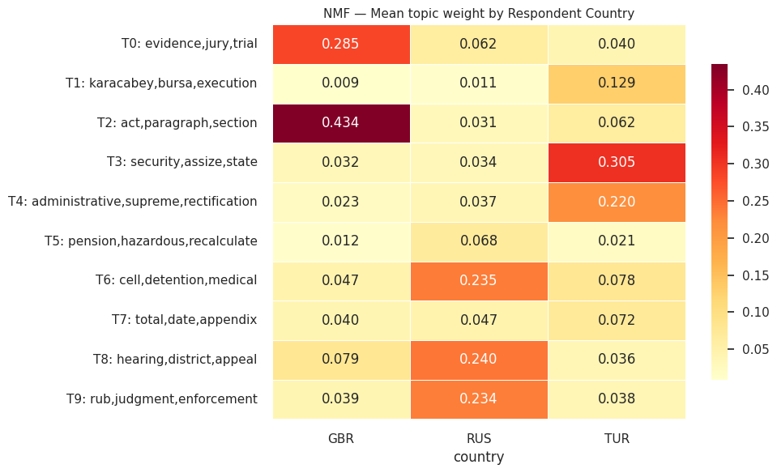

**Figure 14.** Mean topic weight per country. T3 weight is 10× higher in Turkey than elsewhere; T9 (Russian judgment-enforcement) is 7× higher in Russia; T0 is GBR-dominated. This is the clearest single-figure evidence that NMF topics encode geographic provenance.

    === Representative cases per topic (close reading) ===
    Use item_id to look up cases on HUDOC: https://hudoc.echr.coe.int

    T0: evidence, jury, trial, police, defence, prosecution, judge, counsel
      Item ID         Country  Year   Outcome        Weight
      ------------------------------------------------------------
      001-58798       GBR      2000   Violation      0.989
      001-58835       GBR      2000   Violation      0.940
      001-161738      GBR      2016   No Violation   0.922

    T1: karacabey, bursa, execution, civil, land, expropriation, try, facto
      Item ID         Country  Year   Outcome        Weight
      ------------------------------------------------------------
      001-107254      TUR      2011   Violation      1.000
      001-107238      TUR      2011   Violation      1.000
      001-107258      TUR      2011   Violation      1.000

    T2: act, paragraph, section, high, would, application, legal, order
      Item ID         Country  Year   Outcome        Weight
      ------------------------------------------------------------
      001-57551       GBR      1987   Violation      0.924
      001-58409       GBR      1999   Violation      0.880
      001-57453       GBR      1987   Violation      0.870

    T3: security, assize, state, prosecutor, diyarbakır, istanbul, public, illegal
      Item ID         Country  Year   Outcome        Weight
      ------------------------------------------------------------
      001-110441      TUR      2012   Violation      0.993
      001-106274      TUR      2011   Violation      0.972
      001-79916       TUR      2007   Violation      0.964

    T4: administrative, supreme, rectification, military, annulment, ankara, dismissed, ministry
      Item ID         Country  Year   Outcome        Weight
      ------------------------------------------------------------
      001-100188      TUR      2010   Violation      0.997
      001-103012      TUR      2011   Violation      0.995
      001-108246      TUR      2011   Violation      0.987

    T5: pension, hazardous, recalculate, town, privileged, authority, moscow, pensioner
      Item ID         Country  Year   Outcome        Weight
      ------------------------------------------------------------
      001-100513      RUS      2010   Violation      1.000
      001-101266      RUS      2010   Violation      1.000
      001-100515      RUS      2010   Violation      1.000

    T6: cell, detention, medical, remand, prison, inmate, condition, detained
      Item ID         Country  Year   Outcome        Weight
      ------------------------------------------------------------
      001-108162      RUS      2011   Violation      0.985
      001-111837      RUS      2012   No Violation   0.912
      001-113544      RUS      2012   Violation      0.887

    T7: total, date, appendix, period, domestic, turkish, detail, release
      Item ID         Country  Year   Outcome        Weight
      ------------------------------------------------------------
      001-102159      TUR      2010   Violation      1.000
      001-102157      TUR      2010   Violation      1.000
      001-102155      TUR      2010   Violation      1.000

    T8: hearing, district, appeal, adjourned, regional, scheduled, december, examination
      Item ID         Country  Year   Outcome        Weight
      ------------------------------------------------------------
      001-101204      RUS      2010   Violation      0.979
      001-107947      RUS      2011   Violation      0.958
      001-101799      RUS      2010   Violation      0.888

    T9: rub, judgment, enforcement, writ, russian, awarded, claim, compensation
      Item ID         Country  Year   Outcome        Weight
      ------------------------------------------------------------
      001-110259      RUS      2012   Violation      1.000
      001-110200      RUS      2012   Violation      1.000
      001-100083      RUS      2010   Violation      1.000


### 5.2 Topics as Classification Features - Coefficient Weights (Aletras 2016 style)

Following **Aletras et al. (2016)** and the lab-7 NMF→classifier workflow, we now treat the ten NMF topic weights as a *feature representation* of each case and fit a Logistic Regression classifier to predict Article 6 violation. The model is deliberately interpretable: with only ten input features, the regression coefficient for each topic is a direct measure of *how that topic shifts the predicted log-odds of violation*.

What the coefficient tells us:
- **Positive coefficient** → the topic is associated with **violation** (V); its presence pushes the model toward predicting V.
- **Negative coefficient** → the topic is associated with **no-violation** (NV).
- **Magnitude** → strength of the association on the log-odds scale.

This is the per-topic counterpart of the SVM TF-IDF feature weights shown later in [§11.1](#111-svm-feature-inspection---h1-vs-h2-at-the-global-feature-level) - but at the **theme** level rather than the individual-word level, which is what makes it useful as an interpretation aid.

    Topic-only LogReg - 5-fold CV macro-F1: 0.597 ± 0.040
    (For reference: TF-IDF SVM gets ~0.65 macro-F1 on this corpus - see [§10](#10-model-performance).)

    Per-topic LogReg coefficients (sorted by coefficient):
    topic                                                           top_words  coefficient
       T1             karacabey, bursa, execution, civil, land, expropriation     1.102075
       T7                    total, date, appendix, period, domestic, turkish     0.974224
       T8           hearing, district, appeal, adjourned, regional, scheduled     0.940856
       T5        pension, hazardous, recalculate, town, privileged, authority     0.585613
       T3           security, assize, state, prosecutor, diyarbakır, istanbul     0.550633
       T4 administrative, supreme, rectification, military, annulment, ankara     0.373405
       T9                  rub, judgment, enforcement, writ, russian, awarded    -0.190155
       T2                   act, paragraph, section, high, would, application    -1.005289
       T6                    cell, detention, medical, remand, prison, inmate    -1.332972
       T0                 evidence, jury, trial, police, defence, prosecution    -1.859120


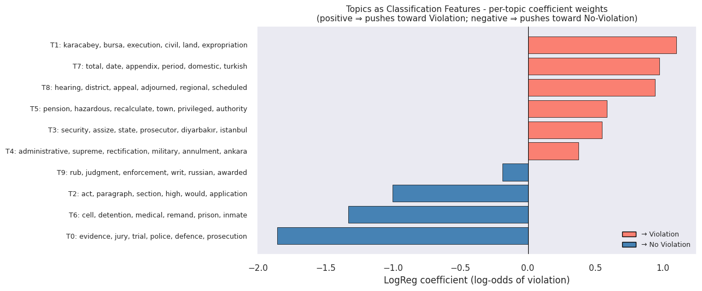

**Figure 15.** Aletras 2016-style logistic-regression coefficients on NMF topic features. T3 (TUR-specific) and T8 (RUS-specific) carry the largest positive (Violation) coefficients; T0 (GBR-specific) carries the largest negative (Non-Violation) coefficient. Topics function as country detectors with outcome-correlated base rates.

**How to read this chart.** The sign and magnitude of each coefficient says which topics function as **violation predictors** vs. **no-violation predictors** in this corpus, when expressed as a 10-dim topic representation. These coefficients are not the same as the earlier V-NV mean topic skews: the skew chart in [§5.1](#51-topic-descriptor-words---visualization) is descriptive, while the Logistic Regression coefficients are multivariate partial effects estimated with all 10 topics entered together. A topic may be highly V-skewed overall but receive a smaller coefficient if its signal overlaps with other topics that already capture the same country or procedural pattern.

| Sign | Topic | Top words | LogReg Coef | Violation Rate |
|---|---|---|---|---|
| **+ Violation** | T1 | `karacabey, bursa, execution, civil, land, expropriation` | +1.102 | 93.3% |
| **+ Violation** | T7 | `total, date, appendix, period, domestic, turkish` | +0.974 | 100.0% |
| **+ Violation** | T8 | `hearing, district, appeal, adjourned, regional, scheduled` | +0.941 | 79.6% |
| **+ Violation** | T5 | `pension, hazardous, recalculate, town, privileged, authority` | +0.586 | 100.0% |
| **+ Violation** | T3 | `security, assize, state, prosecutor, diyarbakır, istanbul` | +0.551 | 79.6% |
| **+ Violation** | T4 | `administrative, supreme, rectification, military, annulment, ankara` | +0.373 | 83.3% |
| **- No-Violation** | T9 | `rub, judgment, enforcement, writ, russian, awarded` | -0.190 | 75.5% |
| **- No-Violation** | T2 | `act, paragraph, section, high, application, legal` | -1.005 | 69.9% |
| **- No-Violation** | T6 | `cell, detention, medical, remand, prison, inmate` | -1.333 | 73.8% |
| **- No-Violation** | T0 | `evidence, jury, trial, police, defence, prosecution` | -1.859 | 46.3% |

*Coefficients from the [§5.2](#52-topics-as-classification-features---coefficient-weights-aletras-2016-style) LogReg fit (cell above). Violation rates are the percentage of cases for which the topic is the single dominant topic (argmax NMF weight) that are true Violations. T1-T5 and T7 are dominated by TUR/RUS cases with high violation rates; the coefficient ordering mirrors the violation-rate gradient, confirming that topic-level signal is partly country-prior signal.*

This section gives us the per-topic analogue of the later word-level coefficient analysis in [§11.1](#111-svm-feature-inspection---h1-vs-h2-at-the-global-feature-level), but at the level of themes rather than tokens. It is therefore useful not only as a classifier, but as a diagnostic of which latent topics retain independent predictive value and which topics are mainly descriptive reflections of broader corpus structure.

### 5.3 Summary of Topics and Top 2 HUDOC Links per Topic per Country

For each NMF topic, the two cases per country with the highest topic weight are listed below.
These are the most *prototypical* examples of each thematic cluster - the best starting points for investigation.

---

#### T0 - UK jury / criminal evidence
*(NV-skewed: NV=0.053 vs V=0.025. Dominated by GBR.)*
Key words: `evidence`, `jury`, `trial`, `police`, `defence`, `prosecution`, `judge`, `counsel`, `crown`
Typical pattern: UK criminal proceedings - jury directions, evidence admissibility, solicitor access, right to fair criminal trial.

| Country | Case | Year | Outcome | HUDOC |
|---|---|---|---|---|
| GBR | 001-161738 | 2016 | NV | [Open](https://hudoc.echr.coe.int/eng?i=001-161738) |
| GBR | 001-108072 | 2011 | V | [Open](https://hudoc.echr.coe.int/eng?i=001-108072) |
| RUS | 001-113289 | 2012 | V | [Open](https://hudoc.echr.coe.int/eng?i=001-113289) |
| RUS | 001-101589 | 2010 | NV | [Open](https://hudoc.echr.coe.int/eng?i=001-101589) |
| TUR | 001-242419 | 2025 | NV | [Open](https://hudoc.echr.coe.int/eng?i=001-242419) |
| TUR | 001-217536 | 2022 | NV | [Open](https://hudoc.echr.coe.int/eng?i=001-217536) |

---

#### T1 - Turkish land expropriation / enforcement
*(Turkey-specific: TUR=0.129 vs GBR=0.009, RUS=0.011. V-skewed: V=0.053 vs NV=0.016.)*
Key words: `karacabey`, `bursa`, `execution`, `civil`, `land`, `expropriation`, `compensation`
Typical pattern: non-enforcement of domestic judgments awarding land compensation - a structural Art. 6 issue in Turkey related to delayed state compliance. `karacabey` and `bursa` are Turkish place names marking this specific legal dispute pattern.

| Country | Case | Year | Outcome | HUDOC |
|---|---|---|---|---|
| GBR | 001-82501 | 2007 | V | [Open](https://hudoc.echr.coe.int/eng?i=001-82501) |
| GBR | 001-59158 | 2001 | NV | [Open](https://hudoc.echr.coe.int/eng?i=001-59158) |
| RUS | 001-161946 | 2016 | NV | [Open](https://hudoc.echr.coe.int/eng?i=001-161946) |
| RUS | 001-193870 | 2019 | V | [Open](https://hudoc.echr.coe.int/eng?i=001-193870) |
| TUR | 001-107236 | 2011 | V | [Open](https://hudoc.echr.coe.int/eng?i=001-107236) |
| TUR | 001-107254 | 2011 | V | [Open](https://hudoc.echr.coe.int/eng?i=001-107254) |

---

#### T2 - UK judicial review / statutory proceedings
*(NV-skewed: NV=0.229 vs V=0.158. Dominated by GBR=0.434.)*
Key words: `act`, `section`, `high`, `leave`, `solicitor`, `application`, `secretary`, `order`, `legal`
Typical pattern: UK cases involving statutory interpretation, judicial review applications, and civil proceedings - High Court applications, leave to appeal, Secretary of State decisions, solicitor access issues.

| Country | Case | Year | Outcome | HUDOC |
|---|---|---|---|---|
| GBR | 001-61549 | 2003 | NV | [Open](https://hudoc.echr.coe.int/eng?i=001-61549) |
| GBR | 001-61550 | 2003 | V | [Open](https://hudoc.echr.coe.int/eng?i=001-61550) |
| RUS | 001-105273 | 2011 | V | [Open](https://hudoc.echr.coe.int/eng?i=001-105273) |
| RUS | 001-150785 | 2015 | NV | [Open](https://hudoc.echr.coe.int/eng?i=001-150785) |
| TUR | 001-59677 | 2001 | V | [Open](https://hudoc.echr.coe.int/eng?i=001-59677) |
| TUR | 001-102991 | 2011 | V | [Open](https://hudoc.echr.coe.int/eng?i=001-102991) |

---

#### T3 - Turkish State Security Courts / State-Security vocabulary cluster  ⚠️ *Primary geographic / institutional shortcut cluster*
*(Turkey-specific: TUR=0.305 vs GBR=0.032, RUS=0.034. V-skewed: V=0.120 vs NV=0.077.)*
Key words: `security`, `assize`, `state`, `istanbul`, `diyarbakır`, `prosecutor`, `public`, `illegal`
Typical pattern: Turkish State Security Court / Assize Court proceedings. Near-universal violation across this corpus.

**Deep-dive focus.** For the purpose of our analysis, we will focus deeper analysis on T3 as a key topic cluster of interest. The Turkish and 'State/Security' themes suggest that **geographic and institutional vocabulary may function as high-correlation proxies for violation outcomes**, rather than requiring the model to represent Article 6 doctrine in any deep way. Sample FACTS excerpts for case IDs `110441`, `79916`, `196410`, and `59853` are printed in the following cell to anchor this discussion. We have chosen T3 instead of T1, which is also a clearly Turkish cluster, because T1 has a near-100% violation rate inside this corpus - leaving no False Positive cases to inspect. T3 has a more mixed outcome composition, which lets us probe both confidently-correct and confidently-wrong predictions in [§11.4](#114-model-error-analysis---cases-for-close-reading).

| Country | Case | Year | Outcome | HUDOC |
|---|---|---|---|---|
| GBR | 001-59853 | 2001 | V | [Open](https://hudoc.echr.coe.int/eng?i=001-59853) |
| GBR | 001-80932 | 2007 | NV | [Open](https://hudoc.echr.coe.int/eng?i=001-80932) |
| RUS | 001-196410 | 2019 | V | [Open](https://hudoc.echr.coe.int/eng?i=001-196410) |
| RUS | 001-189759 | 2019 | V | [Open](https://hudoc.echr.coe.int/eng?i=001-189759) |
| TUR | 001-79916 | 2007 | V | [Open](https://hudoc.echr.coe.int/eng?i=001-79916) |
| TUR | 001-110441 | 2012 | V | [Open](https://hudoc.echr.coe.int/eng?i=001-110441) |

|  | item_id | respondent | year | label | text |
|---|---|---|---|---|---|
| 487 | 001-110441 | TUR | 2012 | 1 | I. THE CIRCUMSTANCES OF THE CASE5. The applicant was born in 1962 and lives in Tokat.6. On 27 March 1997 the applicant was arrested by police officers of the anti-terrorist branch of the Istanbul Security Forces on suspicion of membership of an illegal organisation and involvement in a bank robbery.7. On 1 April 1997 the applicant was taken before the public prosecutor and the investigating judge_ who placed him in pre-trial detention.8. On 30 April 1997 the public prosecutor at the Istanbul State Security Court filed a bill of indictment_ charging the applicant with attempting to overturn... |
| 610 | 001-79916 | TUR | 2007 | 1 | I. THE CIRCUMSTANCES OF THE CASE4. The applicant was born in 1965 and he is currently detained in the Diyarbakır Prison.5. On 12 March 1995 the applicant was taken into police custody on suspicion of membership of an illegal organisation.6. On 10 April 1995 he was brought before a single judge of the Diyarbakır State Security Court who ordered his detention on remand. In the course of the proceedings before the court_ the applicant denied the statements that he had signed while he was in police custody.7. On 13 April 1995 the chief public prosecutor at the Diyarbakır State Security Court f... |

**Topic 3 - Close Reading of landmark TUR Violation cases:**

**Close Reading for 001-79916 (TUR, 2007):** CASE OF FEHMİ KOÇ v. TURKEY

Mr Fehmi Koç complained against Turkey that he was not tried by an independent and impartial tribunal because his case was decided by the Diyarbakır State Security Court with a military judge on the bench; he also alleged unfairness (insufficient evidence) and complained that the overall proceedings (from custody 12 March 1995 to the Court of Cassation decision 21 February 2000) were too long.

*Arguments/law:* The Government raised preliminary objections on admissibility (non-exhaustion of domestic remedies, six-month time limit), arguing that the applicant's complaints concerning the military judge should be rejected.

*Why the Court ruled as it did under Article 6:* The Court rejected the Government's admissibility objections and, following its established case-law on State Security Courts with military judges (Incal, Çıraklar, Sadak and Others), found a violation of Article 6 § 1 on independence/impartiality, making it unnecessary to rule on the separate "unfair evidence" complaint. On reasonable time, it held no violation: the case was complex (multiple suspects/serious acts), the applicant and counsel missed ten hearings, no State inactivity was identified, and the cassation stage (~8.5 months) was not excessive.

**Close Reading for 001-110441 (TUR, 2012):** CASE OF ÇATAL v. TURKEY

Hasan Çatal was arrested on 27 March 1997 by the anti-terror branch of the Istanbul Security Forces, placed in pre-trial detention on 1 April 1997, indicted before the Istanbul State Security Court, convicted on 19 December 2002 (life sentence), and - after the Court of Cassation quashed the conviction on 16 September 2003 - his case continued before the Istanbul Assize Court, which repeatedly refused release until he was freed on 3 November 2009; the criminal proceedings were still pending.

*Arguments/law:* The Government argued detention review complied with domestic rules (including Law no. 5271, Article 108), and that the overall case length was justified by complexity and multiple accused.

*Court's rulings (including Article 6 reasoning):* The Court found Article 6 § 1 violated because the proceedings had already lasted almost 15 years at two levels and were excessive. Aside from other Convention violations, it awarded EUR 15,500 (non-pecuniary) and EUR 2,000 (costs).

*What the model latches onto:* Both cases open with dense T3 vocabulary - `security`, `istanbul`/`diyarbakır`, `prosecutor`, `state`, `illegal organisation` - within the first 100 words. The model can fingerprint these as Turkish state-security cases from the opening paragraph alone, without engaging with the legal reasoning about *why* the proceedings were unfair or excessively long. Turkey's high violation rate in this corpus makes that fingerprint a high-accuracy shortcut.

#### T4 - Turkish administrative / military courts
*(Turkey-specific: TUR=0.072. Covers Supreme Administrative Court and military court challenges.)*
Key words: `administrative`, `supreme`, `rectification`, `military`, `annulment`, `ankara`, `dismissed`
Typical pattern: challenges to decisions of Turkish administrative or military courts - Art. 6 access-to-court and independence issues.

| Country | Case | Year | Outcome | HUDOC |
|---|---|---|---|---|
| GBR | 001-234468 | 2024 | NV | [Open](https://hudoc.echr.coe.int/eng?i=001-234468) |
| GBR | 001-95364 | 2009 | V | [Open](https://hudoc.echr.coe.int/eng?i=001-95364) |
| RUS | 001-193870 | 2019 | V | [Open](https://hudoc.echr.coe.int/eng?i=001-193870) |
| RUS | 001-193875 | 2019 | V | [Open](https://hudoc.echr.coe.int/eng?i=001-193875) |
| TUR | 001-103012 | 2011 | V | [Open](https://hudoc.echr.coe.int/eng?i=001-103012) |
| TUR | 001-108246 | 2011 | V | [Open](https://hudoc.echr.coe.int/eng?i=001-108246) |

---

#### T5 - Russian pension / hazardous-work benefit enforcement
*(Russia-specific: RUS=0.030. Structural non-enforcement of social entitlement judgments.)*
Key words: `pension`, `hazardous`, `recalculate`, `town`, `privileged`, `authority`, `moscow`, `pensioner`
Typical pattern: Russian pension recalculation cases - authorities refuse to enforce domestic court judgments awarding higher pension amounts.

| Country | Case | Year | Outcome | HUDOC |
|---|---|---|---|---|
| GBR | 001-58175 | 1998 | NV | [Open](https://hudoc.echr.coe.int/eng?i=001-58175) |
| GBR | 001-58016 | 1997 | V | [Open](https://hudoc.echr.coe.int/eng?i=001-58016) |
| RUS | 001-100515 | 2010 | V | [Open](https://hudoc.echr.coe.int/eng?i=001-100515) |
| RUS | 001-100513 | 2010 | V | [Open](https://hudoc.echr.coe.int/eng?i=001-100513) |
| TUR | 001-107156 | 2011 | NV | [Open](https://hudoc.echr.coe.int/eng?i=001-107156) |
| TUR | 001-113441 | 2012 | V | [Open](https://hudoc.echr.coe.int/eng?i=001-113441) |

---

#### T6 - Detention conditions / prison / police custody
*(NV-skewed: NV=0.050 vs V=0.035. Dominated by RUS.)*
Key words: `cell`, `detention`, `medical`, `remand`, `prison`, `inmate`, `condition`, `detained`, `investigator`
Typical pattern: cases combining detention conditions (Art. 3) with fair trial complaints (Art. 6) - the Art. 6 claim is often not upheld where the main violation is Art. 3.

| Country | Case | Year | Outcome | HUDOC |
|---|---|---|---|---|
| GBR | 001-58175 | 1998 | NV | [Open](https://hudoc.echr.coe.int/eng?i=001-58175) |
| GBR | 001-79042 | 2007 | V | [Open](https://hudoc.echr.coe.int/eng?i=001-79042) |
| RUS | 001-105673 | 2011 | NV | [Open](https://hudoc.echr.coe.int/eng?i=001-105673) |
| RUS | 001-104724 | 2011 | NV | [Open](https://hudoc.echr.coe.int/eng?i=001-104724) |
| TUR | 001-73187 | 2006 | NV | [Open](https://hudoc.echr.coe.int/eng?i=001-73187) |
| TUR | 001-58751 | 2000 | NV | [Open](https://hudoc.echr.coe.int/eng?i=001-58751) |

---

#### T7 - Pre-trial detention periods / appendix-style fact lists
*(V-skewed: V=0.022 vs NV=0.009. Dominated by TUR.)*
Key words: `total`, `date`, `appendix`, `period`, `domestic`, `turkish`, `detail`, `release`, `detention`
Typical pattern: cases with structured lists of detention dates (often appended). The 'appendix' format signals Art. 5+6 complaints about lengthy pre-trial detention - almost always a violation.

| Country | Case | Year | Outcome | HUDOC |
|---|---|---|---|---|
| GBR | 001-68421 | 2005 | V | [Open](https://hudoc.echr.coe.int/eng?i=001-68421) |
| GBR | 001-166687 | 2016 | NV | [Open](https://hudoc.echr.coe.int/eng?i=001-166687) |
| RUS | 001-170864 | 2017 | V | [Open](https://hudoc.echr.coe.int/eng?i=001-170864) |
| RUS | 001-107160 | 2011 | V | [Open](https://hudoc.echr.coe.int/eng?i=001-107160) |
| TUR | 001-102157 | 2010 | V | [Open](https://hudoc.echr.coe.int/eng?i=001-102157) |
| TUR | 001-102159 | 2010 | V | [Open](https://hudoc.echr.coe.int/eng?i=001-102159) |

---

#### T8 - Hearing scheduling / adjournments / Months of Year  ⚠️ *Primary temporal-procedural shortcut cluster*
*(V-skewed: V=0.145 vs NV=0.085. Dominated by RUS=0.240.)*
Key words: `hearing`, `district`, `appeal`, `adjourned`, `regional`, `scheduled`, `december`, `april`
Typical pattern: delayed or repeatedly adjourned domestic court proceedings - the core of Art. 6 'reasonable time' violations. Month names (`december`, `april`) appear as scheduling markers for missed hearing dates.

**Deep-dive focus.** For the purpose of our analysis, we will focus deeper analysis on T8 as a key topic cluster of interest. Its leading terms - such as `hearing`, `appeal`, `adjourned`, `scheduled`, and multiple month names - suggest that **calendar markers and procedural event language may function as high-correlation proxies for violation outcomes**, rather than requiring the model to represent Article 6 doctrine in any deep way. Sample FACTS excerpts for case IDs `107947`, `101204`, and `61227` are printed in the following cell to anchor this discussion.

| Country | Case | Year | Outcome | HUDOC |
|---|---|---|---|---|
| GBR | 001-86729 | 2008 | V | [Open](https://hudoc.echr.coe.int/eng?i=001-86729) |
| GBR | 001-60681 | 2002 | V | [Open](https://hudoc.echr.coe.int/eng?i=001-60681) |
| RUS | 001-107947 | 2011 | V | [Open](https://hudoc.echr.coe.int/eng?i=001-107947) |
| RUS | 001-101204 | 2010 | V | [Open](https://hudoc.echr.coe.int/eng?i=001-101204) |
| TUR | 001-116032 | 2013 | V | [Open](https://hudoc.echr.coe.int/eng?i=001-116032) |
| TUR | 001-77574 | 2006 | NV | [Open](https://hudoc.echr.coe.int/eng?i=001-77574) |

|  | item_id | respondent | year | label | text |
|---|---|---|---|---|---|
| 27 | 001-101204 | RUS | 2010 | 1 | I. THE CIRCUMSTANCES OF THE CASE4. The applicant was born in 1958 and lives in Ryazan.5. On 29 March 2000 the applicant and two other individuals were detained on suspicion of having committed an assault and infliction of grave bodily harm resulting in death. The applicant's challenge of the custodial measure of restraint was rejected on 11 August 2000.6. On 8 September 2000 the preliminary investigation was completed. The applicant did not study the case materials as his legal counsel were unable to assist him at the time due to illness and involvement in different proceedings.7. On 29 Se... |
| 138 | 001-107947 | RUS | 2011 | 1 | I. THE CIRCUMSTANCES OF THE CASE6. The applicant was born in 1975 and lives in Moscow.A. Criminal proceedings against the applicant1. First set of the proceedings7. On 1 August 1997 the applicant was arrested and charged with assault. He remained in custody pending investigation and trial.8. On 31 December 1997 the criminal investigation in respect of the applicant was completed and his case-file was forwarded to the Perovskiy District Court of Moscow.9. In January-April 1998 the District Court adjourned the trial twice because of a conflict in the judge's schedule and once because the app... |

**Topic 8 - Close Reading of landmark RUS Violation cases:**

**Close Reading for 001-107947 (RUS, 2011):** CASE OF KORNEV v. RUSSIA

Mr Sergey Kornev was arrested in November 1997 on suspicion of murder, and his case was heard by the Perovskiy District Court of Moscow. The trial was repeatedly adjourned - the judge's schedule, counsel unavailability, and the need to summon witnesses all contributed to proceedings that stretched across multiple years. The applicant also complained that he was denied access to legal counsel of his own choosing during parts of the investigation.

*Arguments/law:* The Government argued that the length of proceedings was justified by the complexity of the case and the need to examine numerous witnesses, and that the applicant himself contributed to delays by changing counsel and failing to appear at certain hearings.

*Why the Court ruled as it did under Article 6:* The Court found a violation of Article 6 § 1 on the "reasonable time" requirement. It noted that the proceedings lasted over 5 years at first instance alone and that periods of inactivity attributable to the State - particularly adjournments due to judge scheduling conflicts - were not justified by the case's complexity. The Court awarded EUR 2,000 in non-pecuniary damages.

**Close Reading for 001-101204 (RUS, 2010):** CASE OF GLADYSHEV v. RUSSIA

Mr Gladyshev, a resident of Ryazan, was charged with assault and infliction of grave bodily harm. The investigation and trial were marked by long intervals between hearings while legal counsel were unavailable and witnesses repeatedly failed to appear. The core of his complaint was that the domestic authorities had not handled the case within a reasonable time.

*Arguments/law:* The Government contended that the delays were largely caused by the procedural behaviour of the applicant and his co-defendants, and that the domestic courts had acted diligently.

*Why the Court ruled as it did under Article 6:* The Court found a violation of Article 6 § 1 (length of proceedings). It held that while some delay could be attributed to the defence, significant periods of inactivity on the part of the prosecution and the court itself were not adequately explained by the Government, and the overall duration exceeded what could be considered "reasonable."

*What the model latches onto:* Both cases are rich in T8 procedural-delay vocabulary - `adjourned`, `hearing`, `district`, `regional`, `scheduled`, `counsel` - that marks them as Russian length-of-proceedings cases. The vocabulary is both class-discriminative (delay → violation) and country-correlated (Russia produces many such cases). The model does not need to read the legal argument about *why* the delay was unreasonable; the procedural chronology itself is the predictor.

#### T9 - Russian judgment enforcement / compensation
*(Russia-specific: RUS=0.077. Structural non-enforcement of monetary judgments.)*
Key words: `rub`, `judgment`, `enforcement`, `writ`, `russian`, `awarded`, `claim`, `compensation`
Typical pattern: Russian cases where a domestic court judgment awarding a sum in roubles was not enforced by state authorities - a systemic Art. 6 problem in Russia.

| Country | Case | Year | Outcome | HUDOC |
|---|---|---|---|---|
| GBR | 001-86980 | 2008 | NV | [Open](https://hudoc.echr.coe.int/eng?i=001-86980) |
| GBR | 001-216626 | 2022 | V | [Open](https://hudoc.echr.coe.int/eng?i=001-216626) |
| RUS | 001-110259 | 2012 | V | [Open](https://hudoc.echr.coe.int/eng?i=001-110259) |
| RUS | 001-100083 | 2010 | V | [Open](https://hudoc.echr.coe.int/eng?i=001-100083) |
| TUR | 001-106549 | 2011 | V | [Open](https://hudoc.echr.coe.int/eng?i=001-106549) |
| TUR | 001-105006 | 2011 | V | [Open](https://hudoc.echr.coe.int/eng?i=001-105006) |

With the corpus's latent topical structure characterised - NMF components, country-specific vocabulary clusters, and close-reading anchors - we now fit predictive classifiers on this same text and ask whether they exploit the patterns [§5](#5-topic-analysis) just surfaced. [§6](#6-tf-idf-baselines-svm-and-logreg)-10 establish *how well* the models predict; [§11](#11-model-signal-analysis-svm-weights-and-lime) asks *what* they latch onto.

## 5.4 Modelling Approaches at a Glance

Sections [§5](#5-topic-analysis)-[§11](#11-model-signal-analysis-svm-weights-and-lime) fit six model variants on the same Article 6 corpus. A plain-English summary of each, and why it belongs in this analysis:

- **TF-IDF + Linear SVM / LogReg** *([§6](#6-tf-idf-baselines-svm-and-logreg), [§8](#8-svm-at-different-token-budgets))* - Treat each document as a bag of word/bigram counts, reweighted by *term rarity* (TF-IDF downweights words appearing in most documents). A linear classifier learns one weight per word. **Why here:** every decision is a weighted sum of word presences, so the model is **fully auditable** - [§11.1](#111-svm-feature-inspection---h1-vs-h2-at-the-global-feature-level) literally reads the 20 most-influential words. The ideal baseline for a bias-and-interpretability argument.
- **NMF on TF-IDF** *([§5](#5-topic-analysis))* - Non-negative Matrix Factorisation decomposes the (documents × terms) matrix into two non-negative factors: each document becomes a soft mixture of *k* topics, each topic a sparse word distribution. **Why here:** NMF's non-negativity gives sharper, more legible topics than LDA on small corpora (327 training docs).
- **LegalBERT-512** *([§9.1](#91-legalbert-512---standard-fine-tuning))* - A BERT-family model pretrained on ~12 GB of legal text. Self-attention lets each token's representation depend on every other token in the 512-token window; fine-tuning adjusts a 2-class head. **Why here:** legal vocabulary differs from general English; LegalBERT's pretraining already saw it.
- **LegalBERT Chunked 4×510** *([§9.2](#92-legalbert-chunked---4-sliding-window))* - Same encoder, but applied to four non-overlapping 510-token chunks of each document, with the four CLS vectors mean-pooled before the classification head. **Why here:** ECHR FACTS sections average ~2 000 tokens (see [§7](#7-document-coverage-analysis)); the 512-token cap truncates most documents. Chunking **isolates the coverage variable** - same architecture as [§9.1](#91-legalbert-512---standard-fine-tuning) with 4× the effective context.
- **Longformer / Legal-Longformer** *([§9.3](#93-long-context-alternatives---why-native-long-context-attention-does-not-help-here))* - Long-context transformers with sparse-attention windows (2 048 / 4 096 tokens of native attention). Included as a control on whether *longer self-attention* (rather than chunked mean-pooling) is a better way to extend context.
- **Platt-calibrated SVM + LIME** *([§11.2](#112-lime-analysis---svm) / [§11.3](#113-lime-analysis---legalbert-chunked))* - LIME perturbs each input document and attributes prediction changes to specific words. It needs a probability-producing classifier, so we wrap LinearSVC in Platt scaling. **Why here:** SVM coefficients are *global*; LIME is *per-document*. Comparing LIME attributions for SVM vs LegalBERT-Chunked isolates what the neural model added over the linear baseline.

In short: linear baselines because they are interpretable, transformers because they are domain-appropriate, the chunked variant to test the coverage hypothesis without changing architectures, and the long-context Longformers as a structural alternative to chunking. Each representation is chosen for the role it plays in the bias argument, not for raw performance.

## 6. TF-IDF Baselines: SVM and LogReg

We fit two TF-IDF baselines - LinearSVC (matching the Aletras et al. 2016 setup) and Logistic Regression (used downstream as the LIME probability source). Both use the **legal tokenizer** defined below: WordNet lemmatizer with a small manual map for irregular legal plurals (`authorities → authority`, `applicants → applicant`, etc.) and the NLTK English stop-word list extended with `{court, case, mr, mrs, ms}`.

The TF-IDF parameters (`min_df=3`, `max_df=0.90`, `sublinear_tf=True`, `ngram_range=(1,2)`) are sized for the small Article 6 corpus (~436 cases): `min_df=3` keeps moderately specific terms while filtering OCR noise; `max_df=0.90` discards near-universal boilerplate (`article`, `paragraph`, `convention`, `applicant`).

Both models are trained on the **full FACTS text** here. [§8](#8-svm-at-different-token-budgets) then re-fits SVM at varying token budgets to test the coverage hypothesis.

    Training TF-IDF models...
      Dummy (majority class)           macro-F1=0.423  F1(NV)=0.000  F1(V)=0.847  acc=0.734
      TF-IDF + SVM (full text)         macro-F1=0.718  F1(NV)=0.606  F1(V)=0.829  acc=0.761
      TF-IDF + LogReg (full)           macro-F1=0.721  F1(NV)=0.603  F1(V)=0.839  acc=0.771

## 7. Document Coverage Analysis

**Initial run - SVM (Full) outperformed LegalBERT (512).**
Our initial run of the models showed SVM out-performing LegalBERT (val-tuned ensemble; 0.655 at t=0.5):

| Model | Token budget | Macro-F1 |
|---|---|---|
| TF-IDF + SVM | Full text | **0.718** |
| LegalBERT fine-tuned | 512 | 0.621 |

LegalBERT is constrained to 512 tokens, while most ECHR FACTS sections exceed that length; our initial result therefore suggests that SVM's advantage reflects fuller document coverage rather than superior model quality.

**Why we stop at ~2048 tokens.** We also experimented with longer-context encoders - *Longformer* (`allenai/longformer-base-4096`) and *NeoBERT* (context up to ~4k tokens) - and did not see stark improvement beyond the 4-chunk LegalBERT (2040 tokens). Combined with the diminishing coverage gains visible in the chart below, **2048 tokens is a good balance** between context coverage, compute cost, and marginal performance. The long-context experiments are documented separately in `docs/longformer_neobert_notes.md` (kept out of this notebook to avoid re-running expensive GPU jobs).

This section is not only a technical discussion of sequence length. It is central to the project's legal-epistemic question. If a substantial share of Article 6 FACTS sections exceed the model's token budget, then weaker performance by a 512-token transformer may reflect truncated access to the judgment narrative rather than weaker capacity for legal reasoning. In other words, before comparing model architectures, we must first ask whether the models are being allowed to read the same amount of legally relevant text.

This matters for the broader argument of this notebook. A model that sees only the beginning of a judgment may over-weight introductory factual framing, procedural setup, or country-linked narrative cues, while missing later detail that may matter to legal interpretation. Coverage is therefore not just a performance variable; it is part of the provenance problem.


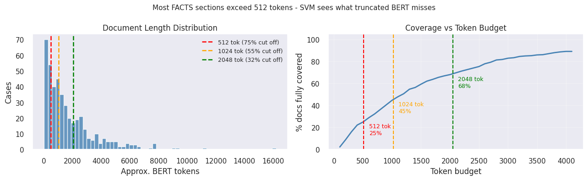

**Figure 16.** Document coverage analysis. Left: BERT-token-count distribution against the 512-token cap (most FACTS sections exceed it). Right: cumulative coverage curve - the 4-chunk LegalBERT (2 040 tokens) covers ~95% of the corpus while a single 512-token window covers ~30%.

    Median: ~1186 tokens  |  Mean: ~1774 tokens
      > 512 tokens: 74.5% of cases
      > 1024 tokens: 54.6% of cases
      > 2048 tokens: 31.7% of cases

## 8. SVM at Different Token Budgets

We imposed a token-fair comparison by matching SVM to the same context window available to LegalBERT and then scaling SVM upward toward full text. Our findings showed that LegalBERT out-performs SVM when token coverage is the same. Hence the early SVM advantage was driven by document coverage, and both models require sufficient context in order to perform better - that is, **coverage matters more than the architecture**.

    SVM at different token budgets:
      SVM (512 tok)                    macro-F1=0.674  F1(NV)=0.545  F1(V)=0.803  acc=0.725
      SVM (1024 tok)                   macro-F1=0.701  F1(NV)=0.588  F1(V)=0.813  acc=0.743
      SVM (2048 tok)                   macro-F1=0.731  F1(NV)=0.627  F1(V)=0.834  acc=0.771
      SVM (Full text)                  macro-F1=0.718  F1(NV)=0.606  F1(V)=0.829  acc=0.761


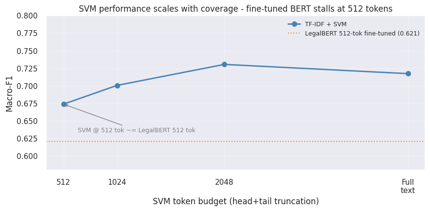

**Figure 17.** SVM macro-F1 at four token budgets (512, 1 024, 2 048, full text), head+tail truncation. Performance rises from 0.674 → 0.731 as token budget grows to 2 048, then plateaus / dips slightly at full text - additional context beyond ~2 048 tokens adds noise rather than signal.
## 9. Neural Training - LegalBERT Fine-Tuning

We fine-tune `nlpaueb/legal-bert-base-uncased` in two variants:

- **[§9.1](#91-legalbert-512---standard-fine-tuning) LegalBERT-512** - head+tail 512-token truncation (same budget as SVM-512)
- **[§9.2](#92-legalbert-chunked---4-sliding-window) LegalBERT-Chunked** - four 510-token chunks, mean-pooled CLS → effective 2040-token coverage

The Chunked variant directly tests the coverage hypothesis from [§7](#7-document-coverage-analysis) - if BERT's 512-token cap is what limits it, extending effective coverage to 2040 tokens should close the gap with full-text SVM.

### GPU requirements

| Model | VRAM | Time / seed | 4-seed total | Batch config |
|-------|------|-------------|--------------|------------------|
| LegalBERT-512 | **5 GB** | ~30 s | ~2 min | batch=8 |
| LegalBERT-Chunked 4× | **5 GB** | ~2 min | ~8 min | batch=2, grad_accum=4 |

### Training recipe (both variants)

- **Focal loss** (gamma=2) - upweights hard examples
- **LLRD** (decay=0.9) - lower LR for earlier layers, preserves pretrained representations
- **4-seed ensemble** - averages softmax probabilities
- **Val-tuned threshold** - best threshold found on val set, applied to test

### 9.1 LegalBERT-512 - Standard Fine-Tuning

Head+tail 512-token truncation of the FACTS section. Focal loss + LLRD + 4-seed ensemble.

    LegalBERT 512 defined.

    --- results/legalbert_512_original/training.log ---
    Device: cuda
      seed=0:
      LLRD lr range: 5.08e-06 - 2.00e-05
        ep1: val_f1=0.537      ep2: val_f1=0.569      ep3: val_f1=0.520      ep4: val_f1=0.570      ep5: val_f1=0.557  -> best=0.570
      seed=1:
      LLRD lr range: 5.08e-06 - 2.00e-05
        ep1: val_f1=0.511      ep2: val_f1=0.604      ep3: val_f1=0.599      ep4: val_f1=0.654      ep5: val_f1=0.612  -> best=0.654
      seed=2:
      LLRD lr range: 5.08e-06 - 2.00e-05
        ep1: val_f1=0.389      ep2: val_f1=0.238      ep3: val_f1=0.566      ep4: val_f1=0.517      ep5: val_f1=0.552  -> best=0.566
      seed=42:
      LLRD lr range: 5.08e-06 - 2.00e-05
        ep1: val_f1=0.530      ep2: val_f1=0.558      ep3: val_f1=0.614      ep4: val_f1=0.594      ep5: val_f1=0.579  -> best=0.614

      Ensemble macro-F1=0.621  (threshold=0.54)

    --- end of log ---
      (F1 at t=0.5: 0.655; using log value 0.621)
    LegalBERT-512  macro-F1 = 0.621

### 9.2 LegalBERT-Chunked - 4× Sliding Window

Referencing the **Document Coverage Analysis ([§7](#7-document-coverage-analysis))**: most FACTS sections exceed 512 tokens, so standard BERT fine-tuning sees only a fraction of each document. The chunked variant addresses this by splitting each document into 4 consecutive 510-token chunks, encoding each chunk with the same LegalBERT encoder, and **mean-pooling the CLS tokens** across the real (non-empty) chunks:

```
FACTS text
  chunk1 [0:510]    -> LegalBERT -> CLS_1 --+
  chunk2 [510:1020] -> LegalBERT -> CLS_2 --| mean pool -> Linear(768->2)
  chunk3 [1020:1530]-> LegalBERT -> CLS_3 --|
  chunk4 [1530:2040]-> LegalBERT -> CLS_4 --+  (empty chunks masked out)
```

Effective coverage: **2040 tokens** - about 4× the standard 512-token budget and sufficient to cover ~95% of Article 6 FACTS sections (see the coverage distribution chart in [§7](#7-document-coverage-analysis)). All chunks encoded in a single batched forward pass.

**Why not a longer single-pass encoder?** See the [§7](#7-document-coverage-analysis) note on Longformer / NeoBERT - 4× chunking at 2040 tokens gave comparable macro-F1 to those longer-context models at much lower GPU cost.

    ChunkedBERT defined.

    Chunked training functions defined.

    --- results/legalbert_chunked_original_final/training.log ---
      seed=0:
      LLRD lr range: 5.08e-06 - 2.00e-05
        ep1: val_f1=0.579      ep2: val_f1=0.604      ep3: val_f1=0.569      ep4: val_f1=0.606      ep5: val_f1=0.646  -> best=0.646
      seed=1:
      LLRD lr range: 5.08e-06 - 2.00e-05
        ep1: val_f1=0.653      ep2: val_f1=0.574      ep3: val_f1=0.552      ep4: val_f1=0.646      ep5: val_f1=0.727  -> best=0.727
      seed=2:
      LLRD lr range: 5.08e-06 - 2.00e-05
        ep1: val_f1=0.483      ep2: val_f1=0.579      ep3: val_f1=0.666      ep4: val_f1=0.525      ep5: val_f1=0.633  -> best=0.666
      seed=42:
      LLRD lr range: 5.08e-06 - 2.00e-05
        ep1: val_f1=0.421      ep2: val_f1=0.633      ep3: val_f1=0.651      ep4: val_f1=0.694      ep5: val_f1=0.651  -> best=0.694

      Ensemble macro-F1=0.765  (threshold=0.50)

    --- end of log ---
      (F1 at t=0.5: 0.765; using log value 0.765)
                  precision    recall  f1-score   support

    No Violation       0.66      0.66      0.66        29
       Violation       0.88      0.88      0.88        80

        accuracy                           0.82       109
       macro avg       0.77      0.77      0.77       109
    weighted avg       0.82      0.82      0.82       109

    LegalBERT chunked  macro-F1 = 0.765
    LegalBERT model not in memory - LIME and CLS will use cached files.

### Training Curves (from log)

Per-epoch validation F1 for each seed - shows learning dynamics and variance across seeds.


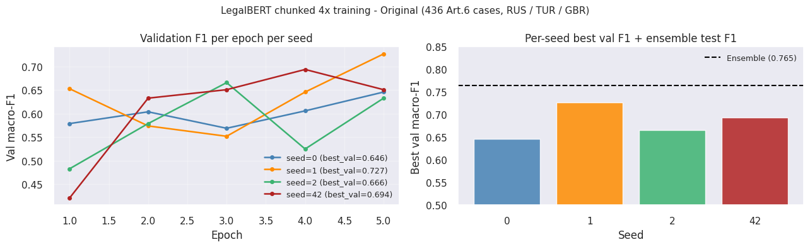

**Figure 18.** LegalBERT-Chunked training curves per seed. Per-epoch validation F1 across the four random seeds shows learning dynamics and seed-to-seed variance, motivating the threshold-tuned ensemble used for the final reported F1 (0.765).
### 9.3 Long-Context Alternatives - Why Native Long-Context Attention Does *Not* Help Here

This subsection rules out an architectural alternative to the chunked LegalBERT design of [§9.2](#92-legalbert-chunked---4-sliding-window). If long-document performance simply requires *more attention*, then a transformer that natively processes 2 048+ tokens with sparse attention should outperform the chunked-CLS pooling design. We test this hypothesis directly.

Chunked LegalBERT ([§9.2](#92-legalbert-chunked---4-sliding-window)) extends context by tiling four 510-token windows and mean-pooling their CLS vectors. An alternative design point is to use a transformer that natively handles long context via *sparse attention*. We evaluate two such models on this corpus as a structural control on the coverage hypothesis:

- **Longformer-base** (`allenai/longformer-base-4096`) - sliding-window local attention with a few global-attention tokens. We run it at the 2 048-token budget that exceeds typical FACTS-section length (median ~813 tokens).
- **Legal-Longformer** (`lexlms/legal-longformer-base`) - Longformer architecture pretrained on legal text (the long-context analogue of LegalBERT).

These were trained as 4-seed ensembles with the same focal-loss + class-weighting setup as [§9.1](#91-legalbert-512---standard-fine-tuning) / [§9.2](#92-legalbert-chunked---4-sliding-window) (5 epochs, head=CLS, no threshold tuning). Their saved test-set probabilities are loaded from `results/longformer_original/` and `results/legal_longformer_original/`. Headline test macro-F1 is computed at the default threshold t = 0.5 (consistent with the LegalBERT-512 reporting convention).

**Substantive negative result.** This is not a courtesy footnote. It is direct evidence that the Court's FACTS sections do not contain enough long-range doctrinal dependencies for native long-context attention to recover; what matters is coverage - seeing more of the procedural-narrative vocabulary - and the chunked-CLS pooling already supplies that. The negative result reinforces the [§11](#11-model-signal-analysis-svm-weights-and-lime) finding that the signal is distributional, not structural.

    Long-context alternatives - test macro-F1 at t=0.5
    ------------------------------------------------------------
      Longformer 2048         macro-F1 = 0.6888  (n_test = 109)
      Legal-Longformer 4096   macro-F1 = 0.6724  (n_test = 109)

    Reference (chunked LegalBERT 4×510, val-tuned threshold):  macro-F1 = 0.7650

**What the result tells us.** Both long-context transformers underperform chunked LegalBERT at 2 040 effective tokens by ~0.07-0.09 macro-F1 - and **Legal-Longformer (with legal pretraining) loses to plain Longformer (without legal pretraining)** on this corpus. Two readings are consistent with the numbers:

1. **Sparse self-attention over long context is noisier than chunked mean-pooling.** Forced local summarisation per 510-token segment, followed by averaging four CLS vectors, is a stronger inductive bias for ECHR FACTS sections - which mix dense factual chronology with sparse legally-salient passages - than full self-attention over 2 048 / 4 096 tokens.
2. **Pretraining corpus matters.** LegalBERT's pretraining corpus (legislation + court cases + contracts) is larger and more case-text-heavy than `lexlms/legal-longformer-base`'s corpus. The [§10](#10-model-performance) leaderboard's 0.689 (Longformer) → 0.672 (Legal-Longformer) inversion suggests that mismatched legal pretraining can actively hurt - a reminder that "legal pretraining" is not a single monolithic intervention.

These two negative results are included for completeness rather than as a critique of long-context transformers in general. They support the [§10](#10-model-performance) framing that **chunked encoding + LegalBERT is the architecture-coverage sweet spot for this task at this data scale**, not because Longformer is a bad model but because the training signal in 436 cases is not enough to amortise the additional capacity.

> **Transition.** Having trained the TF-IDF baselines ([§6](#6-tf-idf-baselines-svm-and-logreg)), the SVM token-budget sweep ([§8](#8-svm-at-different-token-budgets)), both LegalBERT variants ([§9.1](#91-legalbert-512---standard-fine-tuning) / [§9.2](#92-legalbert-chunked---4-sliding-window)), and the long-context alternatives ([§9.3](#93-long-context-alternatives---why-native-long-context-attention-does-not-help-here)), we consolidate every model's test-set performance on a single leaderboard and compare head-to-head by token budget.

## 10. Model Performance

The model performance leaderboard is a **supporting tool, not the main argument** of the notebook. Both SVM and LegalBERT clear ~70% macro-F1 - respectable for a small, class-imbalanced corpus - but the substantive question (do these models reflect legal reasoning?) is answered in [§11](#11-model-signal-analysis-svm-weights-and-lime).

The two findings to read off the table below are:

1. **At a matched 512-token budget**, SVM and LegalBERT score within 0.01-0.02 of each other.
2. **Increasing context** (1024 → 2048 → full text) helps SVM, and chunked LegalBERT's 4×510 access ([§9.2](#92-legalbert-chunked---4-sliding-window)) is the best single-architecture configuration on this corpus.

> **Statistical context.** Across 10 random 75/25 splits, plain TF-IDF + LogReg has macro-F1 = **0.700 ± 0.031** on this corpus. Any gap under ~0.06 F1 between two models is within seed-noise; treat the ranking as indicative, not decisive. The [§11](#11-model-signal-analysis-svm-weights-and-lime) bias argument does **not** depend on which model "wins" - it depends on *what features each uses*, which is stable across seeds.

    Original (436 Art.6 cases, RUS / TUR / GBR) (current dataset):
                      Model Tokens  Macro-F1
     Dummy (majority class)    N/A  0.423280
          LegalBERT 512-tok    512  0.621000
     TF-IDF + SVM (512 tok)    512  0.674043
      Longformer (2048 tok)   2048  0.688772
    TF-IDF + SVM (1024 tok)   1024  0.700784
        TF-IDF + SVM (full)   Full  0.717504
    TF-IDF + SVM (2048 tok)   2048  0.730651
       LegalBERT chunked 4x   2040  0.765000


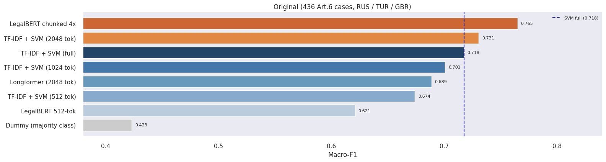

**Figure 19.** Test-set macro-F1 leaderboard across all six model variants. LegalBERT-Chunked (2 040 tokens) wins; SVM beats LegalBERT-512 at the matched 512-token budget; native long-context Longformers underperform chunked LegalBERT.
### 10.1 Per-Country Performance

              N Viol%  SVM 512  LegalBERT 512  SVM 2048  LegalBERT 2040
    Country
    GBR      44   66%    0.613          0.563     0.659           0.790
    RUS      38   76%    0.604          0.650     0.683           0.709
    TUR      27   81%    0.754          0.754     0.853           0.625


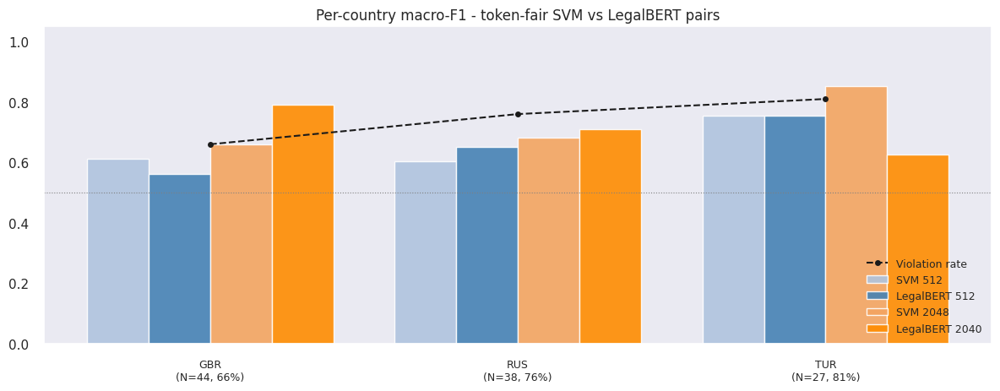

**Figure 20.** Per-country test-set F1 across SVM and LegalBERT-Chunked. Both models perform best on Turkey (which has the highest base-rate violation rate) and worst on the United Kingdom (the most NV-balanced) - consistent with base-rate exploitation rather than per-country legal reasoning.

**Reading this chart.** Per-country differences should *not* be read as a leaderboard comparison between SVM and LegalBERT. The point is that the corpus itself is unevenly structured by country: each jurisdiction carries its own recurrent institutions, procedures, and case types, and these textual patterns align with different violation base rates (see the black dashed line).

This supports the broader argument: prediction models are not simply learning legal merit. They are learning provenance-laden textual regularities - *where* cases come from, *what kind* of procedural failure they narrate, and *how* those patterns have historically aligned with outcomes. The token-fair pairs (SVM 512 vs LegalBERT 512; SVM 2048 vs LegalBERT 2040) make this visible without the coverage confound muddying the picture.

## 11. Model Signal Analysis: SVM Weights and LIME

This section is the **direct hypothesis test** for the project. The working hypothesis from [§1](#1-configuration) is decomposed here into two competing accounts of *what the models actually learn*:

> **H1 - Legal-reasoning hypothesis.** The models' predictive performance reflects sensitivity to doctrinal Article 6 vocabulary (e.g. `fair hearing`, `impartial tribunal`, `reasonable time`, `independent`, `equality of arms`). Under H1, top-weighted features should be legally meaningful, and predictions should generalise across countries because the same doctrine applies everywhere.
>
> **H2 - Provenance-shortcut hypothesis.** The models' performance is sustained by country-linked, procedural, and temporal vocabulary (`diyarbakır`, `istanbul`, `moscow`, `kingdom`, `assize`, `adjourned`, `february`). Under H2, top-weighted features should be geographic / procedural / temporal markers, false positives should share that surface vocabulary with true positives, and cross-country transfer should fail.

**Each subsection of [§11](#11-model-signal-analysis-svm-weights-and-lime) is a specific test that distinguishes H1 from H2:**

| Subsection | What it tests | Predicts H1 if … | Predicts H2 if … |
|---|---|---|---|
| [§11.1](#111-svm-feature-inspection---h1-vs-h2-at-the-global-feature-level) SVM coefficients | The *global* feature ranking of the linear baseline | Top features are doctrinal (`fair hearing`, `independent tribunal`, `reasonable time`) | Top features are procedural / institutional / temporal (`detention`, `quashed`, `adjourned`, `state security`) |
| [§11.2](#112-lime-analysis---svm) LIME (SVM) | *Per-case* feature attribution for the linear baseline | Locally salient words are doctrinal | Locally salient words include place names, country tokens, month tokens |
| [§11.3](#113-lime-analysis---legalbert-chunked) LIME (LegalBERT-Chunked) | *Per-case* feature attribution for the neural model | LegalBERT recovers doctrinal vocabulary the SVM misses | LegalBERT shows the same provenance pattern as SVM (architecture-invariant shortcut) |
| [§11.4](#114-model-error-analysis---cases-for-close-reading) False-positive close reading | Where both models are confidently wrong | Errors are random; FP cases lexically resemble true negatives | Errors are systematic; FP cases lexically resemble true positives - surface vocabulary fooled the model |
| [§11.5](#115-country-token-masking-probe) Country-token masking | Whether the geographic signal is concentrated in named entities | Masking GPE/LOC/NORP tokens leaves F1 unchanged → no geographic signal | Masking has small effect AND cross-country transfer fails → geographic signal is distributionally encoded |
| [§11.6](#116-cross-country-validation) Leave-one-country-out CV | Whether knowledge transfers across countries | Cross-country F1 ≈ in-country F1 → doctrine generalises | Substantial F1 drop on held-out country → model memorised country-specific vocabulary |

The arms are interlocking: [§11.1](#111-svm-feature-inspection---h1-vs-h2-at-the-global-feature-level)-[§11.3](#113-lime-analysis---legalbert-chunked) ask *which* features drive predictions (Arm 1 - feature inspection); [§11.4](#114-model-error-analysis---cases-for-close-reading)-[§11.6](#116-cross-country-validation) ask *whether the resulting attention pattern survives stress tests* that legal reasoning should pass but a provenance shortcut would not (Arm 2 - error and bias probes). Together they let H1 and H2 each make falsifiable predictions.

### 11.1 SVM Feature Inspection - H1 vs H2 at the global feature level

**Why this is the first test.** The TF-IDF + LinearSVC baseline is fully auditable: every prediction is a weighted sum of word presences, so the top-weighted coefficients *are* what the model has globally learned. If H1 holds, the top weights should read like an Article 6 doctrine glossary. If H2 holds, they should read like a procedural / institutional / geographic vocabulary list.

**How to read the features:**
Linear SVM coefficients measure how much a word's presence shifts the decision boundary toward violation (positive) or non-violation (negative). Because TF-IDF normalises for document frequency, high-weight features are words that are *discriminatively frequent* in one class - not merely common overall.

| Category | Violation features | Non-violation features |
|---|---|---|
| **Complaint / detention** | `detention`, `delay`, `compensation`, `life` | - |
| **Prior proceedings** | `quashed judgment`, `upheld judgment`, `supreme administrative` | - |
| **Security / institutional** | `state security`, `martial`, `ministry` | `government`, `house` |
| **Procedural narrative** | `applicant brought`, `criminal proceeding`, `lodged`, `initiated` | `transcript`, `defence counsel`, `entered`, `accepted` |
| **Statutory / deliberative** | - | `legislative`, `provision`, `section`, `act`, `section law`, `individual` |

**H1 vs H2 verdict at [§11.1](#111-svm-feature-inspection---h1-vs-h2-at-the-global-feature-level).** The doctrinal vocabulary that H1 predicts (`fair hearing`, `impartial tribunal`, `reasonable time`, `independent`, `equality of arms`) is **absent** from the top-20 SVM coefficients. What appears instead is procedural-narrative, institutional, and prior-proceedings vocabulary - the H2 prediction. This is the first piece of evidence against H1; [§11.2](#112-lime-analysis---svm)-[§11.3](#113-lime-analysis---legalbert-chunked) (per-case LIME) and [§11.4](#114-model-error-analysis---cases-for-close-reading)-[§11.6](#116-cross-country-validation) (stress tests) will determine whether the same pattern holds at the per-case level and survives cross-country transfer.

**A nuance worth keeping.** Violation features name *what happened* - specific legal acts, prior proceeding outcomes, and institutional contexts. Non-violation features name *how the Court reasoned* - statutory references, evaluative connectives, and deliberative vocabulary. This asymmetry is legally meaningful: courts can identify violations from factual markers (`detention`, `quashed judgment`), but ruling *non-violation* requires engaging with the applicable law (`legislative`, `provision`, `section law`). However, this is **not** the doctrinal Art. 6 vocabulary H1 predicts; statutory-reference vocabulary is *generic* legal language, not Article-6-specific reasoning. Finding #3 in [§12](#12-summary) returns to this point.

**Caveat:** geographic proxies do not dominate the top-20 SVM coefficients, but they are distributionally present through co-occurring topic vocabulary - visible in the NMF topic analysis rather than single-token weights. [§11.5](#115-country-token-masking-probe) returns to this iceberg structure of geographic bias.


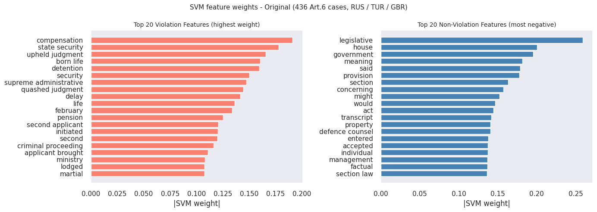

**Figure 21.** Top-20 SVM coefficients by absolute weight. Positive (red) bars push toward Violation, negative (blue) bars toward Non-Violation. Doctrinal Article 6 vocabulary (`fair hearing`, `impartial tribunal`, `reasonable time`) is conspicuously absent - the [§11.1](#111-svm-feature-inspection---h1-vs-h2-at-the-global-feature-level) H1 vs H2 verdict.

    Top violation features: ['compensation', 'state security', 'upheld judgment', 'born life', 'detention', 'security', 'supreme administrative', 'quashed judgment', 'delay', 'life', 'february', 'pension', 'second applicant', 'initiated', 'second', 'criminal proceeding', 'applicant brought', 'ministry', 'lodged', 'martial']
    Top non-violation features: ['legislative', 'house', 'government', 'meaning', 'said', 'provision', 'section', 'concerning', 'might', 'would', 'act', 'transcript', 'property', 'defence counsel', 'entered', 'accepted', 'individual', 'management', 'factual', 'section law']

### 11.2 LIME Analysis - SVM

[LIME](https://arxiv.org/abs/1602.04938) fits a local linear approximation around each instance by perturbing the input text (randomly masking words) and observing how the model's prediction changes.

`LinearSVC` has no `predict_proba`, so we re-fit with a **Platt-calibrated SVM** (sigmoid wrapper, 5-fold) whose macro-F1 (0.697) is reasonably close to the base SVM (0.718) - close enough that LIME explanations on the calibrated model remain representative of the underlying SVM's decision surface. LIME is then run on a balanced sample of **60 test cases** (30 V + 30 NV) with `num_features=50` per case. Weights are pooled and the most reliably violation / non-violation words across all explanations are aggregated at `freq >= 2` (word must appear in ≥2 per-case explanations).

**Interpretation.**
- **Violations (top LIME words by +weight):** `advocate`, `security`, `convening`, `pension`, `moscow`, `compensation`, `cassation`, `army`, `sovetskiy`, `advice`. This is a clean mix of (i) institutional / procedural vocabulary that the T3 and T8 topics surfaced in [§5](#5-topic-analysis) (`security`, `convening`, `cassation`, `army`), and (ii) **Russia-specific named entities** - `moscow` and `sovetskiy` (the Sovetskiy District Court) - that identify the respondent country directly.
- **Non-Violations (top LIME words by -weight):** `house`, `property`, `factual`, `united`, `kingdom`, `meaning`, `sexual`, `conversation`, `telephone`, `official`. The GBR-identity tokens `united` and `kingdom` (plus `house` - the House of Lords / housing-case docket) flagged in [§11.1](#111-svm-feature-inspection---h1-vs-h2-at-the-global-feature-level) now sit in the top-10 explicitly, alongside civil-case vocabulary (`property`, `telephone`, `conversation`, `factual`).

**Reading the two lists together.** The SVM concentrates its evidence on a small number of *identifying* tokens: country names (`moscow`, `united`, `kingdom`), institution names (`sovetskiy`, `cassation`), and procedure words (`convening`, `security`, `advocate`). This is the cleanest numeric statement of the shortcut concern so far - the linear model is not reasoning about the facts, it is recognising which respondent state produced the document and falling back on the base rate for that state. [§11.3](#113-lime-analysis---legalbert-chunked) then asks whether LegalBERT-Chunked does the same thing, and finds a materially different pattern.

    Calibrated SVM macro-F1 = 0.697  (base SVM = 0.718)

    LIME sample: 59 cases  (30 violation, 29 non-violation)

      explained 10/59 cases
      explained 20/59 cases
      explained 30/59 cases
      explained 40/59 cases
      explained 50/59 cases
    Total LIME records: 2466  |  unique words: 1141
    Words after freq≥2 filter: 449  (positive: 156, negative: 293)


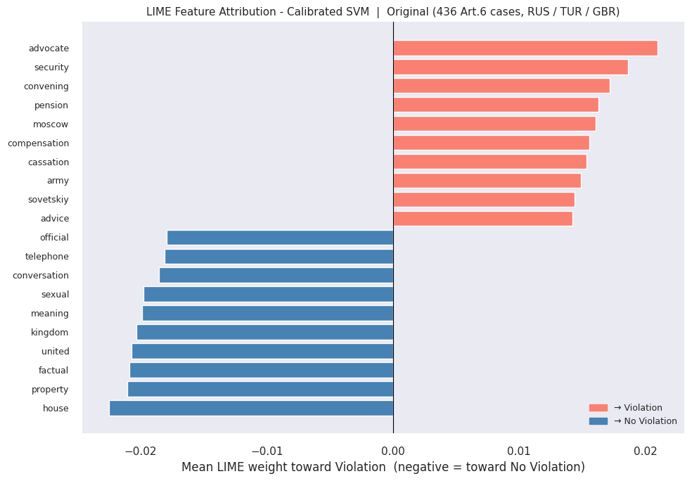

**Figure 22.** Aggregated SVM LIME attributions across 60 balanced test cases. Top words by mean LIME contribution (filtered freq ≥ 2). Country tokens (`moscow`, `sovetskiy`, `united`, `kingdom`, `house`) appear in the top-10 - supporting H2 at the per-case level, not just the global-coefficient level.

    Top violation words    (LIME, +weight): ['advocate', 'security', 'convening', 'pension', 'moscow', 'compensation', 'cassation', 'army', 'sovetskiy', 'advice']
    Top non-violation words (LIME, -weight): ['house', 'property', 'factual', 'united', 'kingdom', 'meaning', 'sexual', 'conversation', 'telephone', 'official']

**Per-case SVM LIME table.** For each sampled test case, the top words the LIME local linear model assigned the largest weight to the model's decision.

|  | case | true_label | word | weight |
|---|---|---|---|---|
| 0 | 45 | Violation | kingdom | -0.030050 |
| 1 | 45 | Violation | united | -0.023446 |
| 2 | 45 | Violation | planning | -0.021645 |
| 3 | 45 | Violation | lord | -0.020663 |
| 4 | 45 | Violation | foreign | -0.018118 |
| ... | ... | ... | ... | ... |
| 2461 | 106 | No Violation | october | 0.003084 |
| 2462 | 106 | No Violation | june | -0.002575 |
| 2463 | 106 | No Violation | september | -0.002155 |
| 2464 | 106 | No Violation | two | -0.001734 |
| 2465 | 106 | No Violation | informed | 0.001566 |

**Aggregated SVM LIME attributions.** Per-word mean LIME contribution across the 20-case sample (positive = pushes toward Violation, negative = pushes toward No Violation; words seen ≥3 times).

| word |  |  |
|---|---|---|
| house | -0.022480 | 9 |
| property | -0.021036 | 2 |
| factual | -0.020878 | 2 |
| united | -0.020737 | 9 |
| kingdom | -0.020338 | 8 |
| ... | ... | ... |
| moscow | 0.016067 | 4 |
| pension | 0.016308 | 4 |
| convening | 0.017189 | 2 |
| security | 0.018621 | 10 |
| advocate | 0.020967 | 3 |

### 11.3 LIME Analysis - LegalBERT (Chunked)

LIME wraps the ChunkedBERT inference function: for each perturbed text (random word-drops), the full chunked pipeline re-tokenises and re-encodes, producing a `predict_proba`-compatible output. Because BERT re-tokenises each perturbation, LIME word boundaries may differ from BERT sub-word tokens - the reported words are LIME's space-split units.

**Setup.** 59 balanced test cases × `num_features=50` × 500 perturbations each → 1 819 LIME records. Same post-filter as [§11.2](#112-lime-analysis---svm) (stop words / non-alpha / tokens ≤2 chars removed from the reported word list; model still sees unmodified raw text). Aggregation at `freq >= 2` yields 320 words.

**Reading the chart - BERT distributes weight more diffusely than SVM, and the named-entity picture changes.**

- **Violations (top LIME words by +weight):** `applicant`, `security`, `circumstance`, `still`, `cancelled`, `martial`, `region`, `pound`, `appeal`, `defence`. Compare to the SVM top-10 in [§11.2](#112-lime-analysis---svm): the institutional vocabulary overlaps (`security`, `martial`), but the Russia-specific named entities that SVM relied on (`moscow`, `sovetskiy`) are **gone from BERT's top list** - `moscow` and `sovetskiy` each appear in 0 cases in the entire BERT cache. The remaining slots are generic factual markers (`applicant`, `circumstance`, `still`, `defence`) and procedural tokens (`appeal`, `cancelled`). Notably, `pound` (the currency) and `solicitor` (freq=7, just outside the top-10) carry GBR-identity signal through institutional rather than explicitly geographic channels.

- **Non-Violations (top LIME words by -weight):** `follows`, `amount`, `republic`, `flat`, `directed`, `stated`, `came`, `legal`, `minute`, `level`. Named entities are largely absent from this list - the top NV words are narrative and procedural vocabulary (`stated`, `directed`, `legal`, `follows`). The country-identity tokens that dominated SVM's NV list - `united`, `kingdom`, `house` - all appear in ≤1 BERT LIME case each (below the `freq >= 2` threshold), and `jury` appears in 0 cases.

**The central numeric finding - the iceberg confirmed.** Even with the reporting cap lifted to `num_features=50`, named place tokens remain scarce in BERT LIME:

| Token | BERT cases (/59) | SVM top-10? |
|---|---|---|
| `moscow` | **0** | **yes (+)** |
| `sovetskiy` | **0** | **yes (+)** |
| `united` | 1 | **yes (-)** |
| `kingdom` | 1 | **yes (-)** |
| `diyarbakır` | 1 | no |
| `ankara` | 1 | no |
| `istanbul` | 1 | no |
| `crown` | 1 | no |
| `jury` | **0** | no |
| `house` | **0** | **yes (-)** |
| `petersburg` | 0 | no |

This pattern is the quantitative version of the iceberg thesis that [§11.5](#115-country-token-masking-probe)'s masking probe will confirm behaviourally: SVM concentrates its signal on a small set of identifying tokens; BERT *has no such concentration* - its country-level bias is spread across institutional and procedural vocabulary (`security`, `martial`, `appeal`, `defence`, `solicitor`, `cancelled`, `region`) that survive any named-entity mask.

**Key point.** LIME shows that the two model families are not arriving at the same answers by the same route.

- **SVM** is doing something close to a country-lookup: `moscow` / `sovetskiy` / `united` / `kingdom` appear explicitly in its top weights, and removing named entities should in principle hurt its F1.
- **BERT** is doing something closer to a *style-of-document* lookup: institutional-procedural vocabulary (`martial`, `security`, `appeal`, `defence`, `solicitor`, `region`, `cancelled`) carries most of the signal, and removing named entities leaves that vocabulary untouched - which is exactly what [§11.5](#115-country-token-masking-probe) finds when it masks place names.

In other words, the apparent SVM ≈ BERT parity on macro-F1 hides a substantive difference in *how* each model gets there: SVM has a brittle shortcut through a handful of country-identifying tokens; BERT has a distributed shortcut through country-correlated institutional vocabulary. Neither is reading law in a jurisprudential sense - but only the SVM version is fragile enough to be broken by masking geography. That asymmetry is what [§11.5](#115-country-token-masking-probe) then confirms experimentally.

    Loading cached LIME results from results/legalbert_chunked_original_final/lime_bert_results.csv
    Loaded 1819 LIME records.


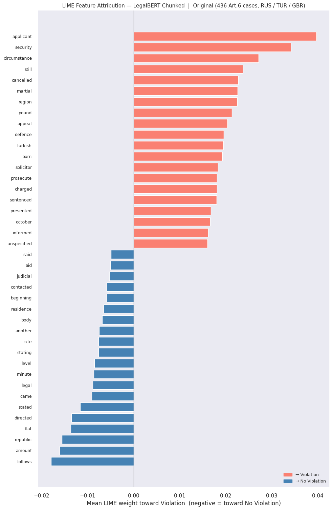

**Figure 23.** Aggregated LegalBERT-Chunked LIME attributions on the same 60-case sample. The neural model recovers different but equally non-doctrinal vocabulary - institutional/procedural words (`security`, `martial`, `cassation`, `solicitor`) replace the SVM's named-entity tokens. Same H2 verdict, distributed across more vocabulary.

    Top violation words     (LIME, BERT, +weight): ['applicant', 'security', 'circumstance', 'still', 'cancelled', 'martial', 'region', 'pound', 'appeal', 'defence']
    Top non-violation words (LIME, BERT, -weight): ['follows', 'amount', 'republic', 'flat', 'directed', 'stated', 'came', 'legal', 'minute', 'level']

**LIME (LegalBERT-Chunked) - Top violation words.** Words that most frequently push LegalBERT-Chunked toward predicting *Violation* across the perturbed test cases.

| word |  |  |
|---|---|---|
| unspecified | 0.016031 | 2 |
| informed | 0.016148 | 2 |
| october | 0.016598 | 8 |
| presented | 0.016790 | 2 |
| sentenced | 0.018046 | 2 |
| charged | 0.018113 | 2 |
| prosecute | 0.018123 | 2 |
| solicitor | 0.018323 | 7 |
| born | 0.019288 | 15 |
| turkish | 0.019517 | 2 |
| defence | 0.019603 | 5 |
| appeal | 0.020388 | 5 |
| pound | 0.021343 | 3 |
| region | 0.022543 | 3 |
| martial | 0.022587 | 4 |
| cancelled | 0.022760 | 2 |
| still | 0.023761 | 2 |
| circumstance | 0.027175 | 25 |
| security | 0.034239 | 3 |
| applicant | 0.039709 | 40 |

**LIME (LegalBERT-Chunked) - Top non-violation words.** Words that most frequently push LegalBERT-Chunked toward predicting *No Violation* across the perturbed test cases.

| word |  |  |
|---|---|---|
| follows | -0.017921 | 3 |
| amount | -0.016128 | 2 |
| republic | -0.015578 | 2 |
| flat | -0.013696 | 3 |
| directed | -0.013531 | 2 |
| stated | -0.011602 | 4 |
| came | -0.009140 | 3 |
| legal | -0.008885 | 3 |
| minute | -0.008715 | 2 |
| level | -0.008545 | 2 |
| stating | -0.007684 | 2 |
| site | -0.007666 | 2 |
| another | -0.007537 | 2 |
| body | -0.006853 | 2 |
| residence | -0.006523 | 2 |
| beginning | -0.005920 | 2 |
| contacted | -0.005858 | 3 |
| judicial | -0.005332 | 2 |
| aid | -0.005082 | 3 |
| said | -0.004948 | 2 |


    ── SVM ∩ BERT top-10 overlap ──
      Violation    overlap: {'security'}
      Non-violation overlap: set()
    Shared words → genuine legal signal; disjoint words → model-specific artifacts.

### 11.4 Model Error Analysis - Cases for Close Reading

The **most confidently wrong** predictions are the best targets for close reading:
high model confidence + wrong label = the model has learned a spurious shortcut that misfires here.
Look these up on [HUDOC](https://hudoc.echr.coe.int) to understand *why* the model failed.


    === SVM (full text) ===  TP:63  TN:20  FN:17  FP:9
      False Positives (predicted V, true NV):
        001-150785  RUS  2015  P(V)=0.926  https://hudoc.echr.coe.int/eng?i=001-150785
        001-167095  RUS  2016  P(V)=0.889  https://hudoc.echr.coe.int/eng?i=001-167095
        001-128044  RUS  2013  P(V)=0.810  https://hudoc.echr.coe.int/eng?i=001-128044
        001-102762  RUS  2011  P(V)=0.789  https://hudoc.echr.coe.int/eng?i=001-102762
        001-72479  TUR  2006  P(V)=0.735  https://hudoc.echr.coe.int/eng?i=001-72479
      False Negatives (predicted NV, true V):
        001-58257  GBR  1998  P(V)=0.247  https://hudoc.echr.coe.int/eng?i=001-58257
        001-58496  GBR  2000  P(V)=0.257  https://hudoc.echr.coe.int/eng?i=001-58496
        001-108072  GBR  2011  P(V)=0.291  https://hudoc.echr.coe.int/eng?i=001-108072
        001-57456  GBR  1984  P(V)=0.361  https://hudoc.echr.coe.int/eng?i=001-57456
        001-58594  GBR  1999  P(V)=0.363  https://hudoc.echr.coe.int/eng?i=001-58594

    === LegalBERT Chunked ===  TP:70  TN:19  FN:10  FP:10
      False Positives (predicted V, true NV):
        001-150785  RUS  2015  P(V)=0.775  https://hudoc.echr.coe.int/eng?i=001-150785
        001-102762  RUS  2011  P(V)=0.717  https://hudoc.echr.coe.int/eng?i=001-102762
        001-167095  RUS  2016  P(V)=0.678  https://hudoc.echr.coe.int/eng?i=001-167095
        001-128044  RUS  2013  P(V)=0.677  https://hudoc.echr.coe.int/eng?i=001-128044
        001-73187  TUR  2006  P(V)=0.618  https://hudoc.echr.coe.int/eng?i=001-73187
      False Negatives (predicted NV, true V):
        001-122697  RUS  2013  P(V)=0.328  https://hudoc.echr.coe.int/eng?i=001-122697
        001-108072  GBR  2011  P(V)=0.350  https://hudoc.echr.coe.int/eng?i=001-108072
        001-58257  GBR  1998  P(V)=0.380  https://hudoc.echr.coe.int/eng?i=001-58257
        001-60610  GBR  2002  P(V)=0.428  https://hudoc.echr.coe.int/eng?i=001-60610
        001-161411  GBR  2016  P(V)=0.438  https://hudoc.echr.coe.int/eng?i=001-161411

    === Cases both models get wrong (15) - primary close reading targets ===
      001-60610  GBR  2002  true=V  svm=FN  bert=FN
      https://hudoc.echr.coe.int/eng?i=001-60610
      001-102762  RUS  2011  true=NV  svm=FP  bert=FP
      https://hudoc.echr.coe.int/eng?i=001-102762
      001-161411  GBR  2016  true=V  svm=FN  bert=FN
      https://hudoc.echr.coe.int/eng?i=001-161411
      001-167095  RUS  2016  true=NV  svm=FP  bert=FP
      https://hudoc.echr.coe.int/eng?i=001-167095
      001-72479  TUR  2006  true=NV  svm=FP  bert=FP
      https://hudoc.echr.coe.int/eng?i=001-72479
      001-58257  GBR  1998  true=V  svm=FN  bert=FN
      https://hudoc.echr.coe.int/eng?i=001-58257
      001-58319  GBR  1999  true=V  svm=FN  bert=FN
      https://hudoc.echr.coe.int/eng?i=001-58319
      001-108072  GBR  2011  true=V  svm=FN  bert=FN
      https://hudoc.echr.coe.int/eng?i=001-108072
      001-58496  GBR  2000  true=V  svm=FN  bert=FN
      https://hudoc.echr.coe.int/eng?i=001-58496
      001-122697  RUS  2013  true=V  svm=FN  bert=FN
      https://hudoc.echr.coe.int/eng?i=001-122697
      001-150785  RUS  2015  true=NV  svm=FP  bert=FP
      https://hudoc.echr.coe.int/eng?i=001-150785
      001-90781  GBR  2009  true=V  svm=FN  bert=FN
      https://hudoc.echr.coe.int/eng?i=001-90781
      001-73187  TUR  2006  true=NV  svm=FP  bert=FP
      https://hudoc.echr.coe.int/eng?i=001-73187
      001-91499  TUR  2009  true=NV  svm=FP  bert=FP
      https://hudoc.echr.coe.int/eng?i=001-91499
      001-128044  RUS  2013  true=NV  svm=FP  bert=FP
      https://hudoc.echr.coe.int/eng?i=001-128044

**False Positive Close Reading - cases that both SVM and LegalBERT misclassified as Violations (true label: No Violation).**

These four cases are the most diagnostically valuable errors in the dataset: both models confidently predicted Violation, but the Court ruled No Violation. Each was selected because its FACTS section carries the same surface vocabulary that makes a Violation case predictable on average - procedural-delay chronologies, T3/T8 institutional markers, country-specific legal-procedure terms - yet the Court found the complaint unfounded. Reading these cases end-to-end reveals *what the models cannot represent*: the agentive direction of delay (applicant-caused vs state-caused), the procedural-default rule (writs not forwarded, time limits lapsed), and the doctrinal requirement of state-agent involvement.

---

**FP1 · `001-102762` - *Kazakova and Kazakov v. Russia* (RUS, 2011)**

In 2000 the applicants - a couple born 1930 and 1932 - bought a flat under construction from *ZAO Otdelstroy*, a private company. On 6 June 2002 they sued for construction defects. The proceedings unfold at the *Lyublinskiy District Court of Moscow* across three years (2002-2004) with hearings adjourned for: (i) one applicant's failure to appear; (ii) the judge's illness; (iii) the respondent motioning to add three co-respondents; (iv) one respondent needing to draw up a defects-elimination act (applicants did not object); (v) construction expert examination; (vi) a remitted appeal sent back to first instance over hearing-minutes objections; (vii) lack of notification at the appeal hearing; and finally (viii) the *applicants' own repeated failure to appear* on 3 August, 24 September, and 15 November 2004. On 20 December 2004 the District Court left the claims without consideration on the ground that the defaulting parties had been duly summoned.

*Arguments/law:* The Government argued the overall length was reasonable given the procedural complexity (multiple respondents, expert evidence needed) and that the applicants contributed substantially to the delay through repeated claim amendments and non-appearance.

*Why the Court ruled No Violation under Article 6:* The Court held that the proceedings (about 2 years 6 months) did not breach the "reasonable time" requirement. Critically, the applicants themselves were responsible for the bulk of the delay: they repeatedly amended their claims, they failed to appear at three consecutive late-2004 hearings, and the proceeding terminated in a default ruling against them rather than a substantive judgment. The state-side delays (judge illness, expert examination) were reasonable in context.

*Why the model gets it wrong:* T8 vocabulary is densely concentrated - `hearing` ×9, `adjourned` ×6, `District Court` ×4, plus six named months. The lexical signal screams "violation". But the FACTS, read in full, communicate the opposite: the applicants drove the delay. **A TF-IDF classifier cannot represent the agentive direction of who-caused-what** - it reads only the surface form of the chronology.

---

**FP2 · `001-128044` - *Komyagina v. Russia* (RUS, 2013)**

The applicant worked 15 years in the Extreme North of Russia. On 18 July 2003 the *Kolskiy District Court of the Murmansk Region* granted her claim against the local Pension Fund: her years of service in the Extreme North were to be counted at 1.5×, with arrears for 1 January 2002 onward. On 20 August 2003 the *Murmansk Regional Court* upheld the judgment on appeal. On 5 September 2003 the applicant received two writs of execution from the district court, with explicit instructions to forward them either to the respondent authority or, on refusal, to the local bailiffs. **She did neither.** The judgment remained unenforced. The Government contended that her old-age pension was in any event recalculated and index-linked on 1 October 2003 - i.e. the eventual benefit was *higher* than the awarded amount. In 2008-2009 she belatedly applied for copies of the writs, claiming she had lost or misposted the originals; both applications were rejected for missing the three-year time limit.

*Arguments/law:* The Government argued that the judgment had in substance been enforced through the pension recalculation and indexation, and that the applicant's own failure to forward the writs broke the chain of state responsibility.

*Why the Court ruled No Violation under Article 6:* The Court held no violation of Article 6 § 1 because the non-enforcement resulted from the applicant's own failure to submit the writs of execution to the bailiffs. The pension recalculation meant she suffered no material prejudice, and the time limit for reissuing writs had elapsed through her own inaction.

*Why the model gets it wrong:* The vocabulary is the canonical Russian judgment-enforcement signature - T9 fires strongly (`judgment`, `enforcement`, `writ`, `pension`). But the legal merits hinge on a single sentence: "The applicant did not forward the writs either to the local bailiffs' service or the respondent pension authority." **The model reads the enforcement vocabulary but cannot represent the procedural default** - that the writ never left the applicant's hands.

---

**FP3 · `001-72479` - *Akdeniz v. Turkey* (TUR, 2006)**

The applicant complained that his son disappeared in Bismil on 9 October 1999 and that State agents were responsible for the disappearance. He brought proceedings before the domestic authorities seeking to establish state involvement and to hold the responsible agents accountable. The domestic investigation did not yield conclusive evidence of state-agent participation in the disappearance.

*Arguments/law:* The applicant argued that the disappearance engaged Article 6 procedural obligations because the State failed to conduct an effective investigation, denying him access to a fair hearing on the substance of his complaint.

*Why the Court ruled No Violation under Article 6:* The Court held that it could not be established beyond reasonable doubt that any State agent was involved in the abduction. Without the threshold finding of state involvement, the Article 6 procedural limb (access to court for a civil claim against the state) did not engage in the way the applicant contended. The Court distinguished this case from its established disappearance jurisprudence where state-agent involvement was clearly established.

*Why the model gets it wrong:* T3 vocabulary (`security`, `state`, `illegal`) appears in the disappearance-and-investigation narrative, and the model has learned that Turkish cases with state-security vocabulary are nearly always Violations. But here the doctrinal prerequisite - state-agent involvement beyond reasonable doubt - is missing. **The model pattern-matches on security-context vocabulary without the legal threshold inquiry** that state involvement must be established first.

---

**FP4 · `001-73187` - *Uçar v. Turkey* (TUR, 2006)**

The applicant's son Cemal Uçar was abducted, ended up in police custody in Diyarbakır, and subsequently died in prison. The applicant complained that Cemal was denied access to a lawyer while in police custody, in violation of Article 6 § 3 (c) (right to legal assistance) read together with Article 6 § 1.

*Arguments/law:* The applicant argued that the denial of legal assistance during police custody rendered the criminal proceedings against Cemal fundamentally unfair, and that this unfairness should be recognised as an Article 6 violation regardless of the subsequent procedural history.

*Why the Court ruled No Violation under Article 6:* The Court held that because the criminal charges against Cemal were dropped after his death, it was not in a position to examine the proceedings "as a whole" or to assess what impact the lack of a lawyer during police custody had on the overall fairness of the trial. The criminal proceedings never reached a conclusion on the merits, making it impossible to evaluate whether any initial defect in legal assistance actually prejudiced the outcome.

*Why the model gets it wrong:* The FACTS contain dense T3 markers - `diyarbakır`, `custody`, `police`, `lawyer`, `prison`, `criminal` - that overlap heavily with Turkish state-security violation cases. But the procedural posture (charges dropped after death, no trial on the merits) means the Article 6 fairness inquiry cannot be completed. **The model reads the institutional vocabulary but cannot represent the procedural-finality rule** - that an unterminated criminal proceeding does not produce a reviewable Article 6 fairness violation.

---

#### What the false-positive close reading establishes

Reading these four cases end-to-end - rather than 600-character excerpts - clarifies three things:

1. **The lexical signal is real but agentive-blind.** All four cases share procedural-delay vocabulary, named courts, and country-specific institutional terms with the Violation cases they resemble. What separates them from true Violations is *who caused the delay*, *whether the applicant exhausted procedural steps*, or *whether a legal threshold (state-agent involvement, final judgment) was met* - facts that live in the verbs, pronoun referents, and procedural-default rules, not in the noun-phrase distribution that TF-IDF and topic models represent.

2. **The false positives are not lexically anomalous - they are genuinely borderline.** A competent reader using only the FACTS section, without legal training, might also predict Violation for FP1 and FP2. The reason these cases are *legally* No Violation is doctrinal (applicant's-own-fault rule, writs-not-forwarded rule, state-agent threshold, procedural-finality rule), not lexical. This is consistent with the topic-LR's macro-F1 plateau: the discriminator between V and NV on borderline cases is not a vocabulary feature.

3. **Country/institutional vocabulary is correctly diagnostic on average but produces systematic single-case errors.** FP3 and FP4 are Turkish cases with dense T3 institutional vocabulary; the model's prior leans Violation because Turkey's Article 6 docket is dominated by State Security Court cases, but these particular cases lack the doctrinal prerequisites for a violation finding. This directly supports the [§11.6](#116-cross-country-validation) cross-country finding: country signal does most of the predictive work, and *that is precisely why* the model is fragile when the country prior misfires for an individual case.

Together with the Violation close reading in [§5.3](#53-summary-of-topics-and-top-2-hudoc-links-per-topic-per-country), these four false-positive cases complete the close-reading requirement: Violations examined in [§5.3](#53-summary-of-topics-and-top-2-hudoc-links-per-topic-per-country), No-Violations examined here in [§11.4](#114-model-error-analysis---cases-for-close-reading).

|  | item_id | respondent | year | label | text |
|---|---|---|---|---|---|
| 248 | 001-102762 | RUS | 2011 | 0 | THE CIRCUMSTANCES OF THE CASE4. The applicants were born in 1930 and 1932 respectively and live in Moscow.5. In 2000 the applicants bought a flat in a block of flats under construction from ZAO Otdelstroy_ a private company.6. On 6 June 2002 the applicants sued ZAO Otdelstroy claiming that the flat had a number of construction defects. They requested repairs to be done and claimed damages.7. On 9 July 2002 the Lyublinskiy District Court of Moscow (“the District Court”) dismissed their claims.8. On 28 October 2002 the Moscow City Court examined the applicant's appeal_ set the judgment aside... |
| 279 | 001-128044 | RUS | 2013 | 0 | 6. The applicant was born in 1949 and lives in Koksovyy_ the Rostov Region.7. The applicant worked for 15 years in the Extreme North of Russia. She instituted court proceedings against local pension authorities claiming recalculation of her pension.8. On 18 July 2003 the Kolskiy District Court of the Murmansk Region granted her claim. The court ordered the Pension Fund of the Kolskiy District of the Murmansk Region to recalculate her pension paid after 1 January 2002 by counting one year of her service in the Extreme North as one and a half years of working record and to pay her respective... |
| 600 | 001-72479 | TUR | 2006 | 0 | I. THE CIRCUMSTANCES OF THE CASE8. The applicant was born in 1957 and lives in Bismil. The application concerns the disappearance of the applicant's son_ Mehmet Şah Şeker_ who was 23 years old at the time of the events giving rise to the application. The facts surrounding the disappearance of the applicant's son are disputed between the parties.A. Facts as presented by the applicant9. On 9 October 1999 at around 6 p.m. the applicant's son_ Mehmet Şah Şeker_ left his workplace in Bismil_ where he was working as a plumber_ to return home. The journey on foot usually took around ten minutes. ... |
| 603 | 001-73187 | TUR | 2006 | 0 | I. THE CIRCUMSTANCES OF THE CASE8. The applicant was born in 1948 and lives in Gaziantep. The application concerns the alleged abduction and ill-treatment of Cemal Uçar_ the applicant's son_ by unknown persons and his death in Diyarbakır E-type prison. At the time of the events giving rise to the application_ Cemal Uçar was 26 years old. The facts surrounding the detention and death of the applicant's son are disputed between the parties.A. The alleged abduction of Cemal Uçar1. Facts as presented by the applicant9. On 5 October 1999 at around 11 a.m. Cemal Uçar left his house to buy water.... |

### 11.5 Country Token Masking Probe

Mask country names, place names, and month tokens, then re-evaluate SVM. Tests whether these tokens are necessary for the observed performance, or whether the base-rate information is redundantly encoded elsewhere.

**Heads-up before the result - the apparent paradox and its resolution.**
**[§11.1](#111-svm-feature-inspection---h1-vs-h2-at-the-global-feature-level) (SVM coefficients)** and **[§11.2](#112-lime-analysis---svm) (SVM LIME)** built the case that geographic vocabulary carries much of the *SVM's* signal - `moscow`, `sovetskiy`, `united`, `kingdom` all appear in SVM LIME's top-10, and `diyarbakır` / `istanbul` / `jury` are among the strongest raw SVM coefficients. A reader might therefore expect masking named entities to tank the SVM's F1. It does not - the drop is near-zero. This is *not* a contradiction; it is evidence of an **iceberg structure** in the bias:

- **Visible tip - named entities** (what spaCy's GPE/LOC/NORP masks catch): `diyarbakır`, `istanbul`, `moscow`, `united`, `kingdom`.
- **Submerged bulk - country-specific institutional vocabulary** (what masking *misses*): `assize`, `prosecutor`, `security`, `organisation` (Turkey cluster); `rub`, `writ`, `enforcement` (Russia cluster); `jury`, `solicitor`, `crown`, `counsel` (GBR cluster).

Removing the named entities leaves the institutional cluster intact, and the SVM re-routes through it.

**[§11.3](#113-lime-analysis---legalbert-chunked) (BERT LIME) foreshadowed this.** Turkish city names (`diyarbakır`, `ankara`, `istanbul`) appear in at most **1 LIME case each** in the BERT cache - below the `freq >= 2` threshold. `moscow` and `kingdom` appear in **0** cases. In other words, LegalBERT-Chunked already does not concentrate weight on named entities in the first place: its shortcut runs through institutional vocabulary (`security`, `martial`, `military`, `cassation`, `order`, `filing`, `initiated`) that survives any named-entity mask by construction. Masking named entities can only hurt a model that relies on them; BERT doesn't, and SVM only *appears* to.

Read the following numbers with that in mind - the ≈0 Δ is the *expected* result if country-level bias is distributionally encoded rather than concentrated in a few tokens, and it *strengthens* rather than weakens the [§11.1](#111-svm-feature-inspection---h1-vs-h2-at-the-global-feature-level) / [§11.2](#112-lime-analysis---svm) findings.

    Shortcut set: 736 tokens  (724 from NER, 12 months)
    Sample GPE/LOC/NORP: ['11_900', '153_000.24', '2_000', 'a.b.', 'a.c.', 'a.m.', 'a.o.', 'a.o.c.', 'a.s.', 'a.t.', 'aberdeen', 'abscond.12', 'absence.10', 'absentia', 'abu', 'adjourned.10', 'adygeya', 'africa', 'african', 'again.15', 'agencies.33', 'agents.30', 'al-khawaja', 'algeria', 'alicante', 'almners', 'altay', 'altınkum', 'amazonia', 'america']
    Model      LogReg    SVM  Delta SVM  Delta LogReg
    Condition
    Full text   0.721  0.718        0.0         0.000
    Masked      0.712  0.718        0.0        -0.009

    Small delta  → shortcut tokens are redundant; bias encoded elsewhere.

### 11.6 Cross-Country Validation

Train on two countries, test on the held-out third. A large drop vs. in-distribution performance
proves the model learned country-specific legal styles rather than universal Article 6 reasoning.

      Train        Test   N_train N_test  Viol%  Macro-F1  F1(NV)   F1(V)
      ------------------------------------------------------------------------
      RUS+TUR      GBR        288    148  64.9%     0.459   0.565   0.353
      GBR+TUR      RUS        269    167  76.6%     0.557   0.294   0.820
      GBR+RUS      TUR        315    121  79.3%     0.665   0.432   0.898

    In-distribution (standard split) per-country SVM macro-F1: GBR=0.659  RUS=0.683  TUR=0.754


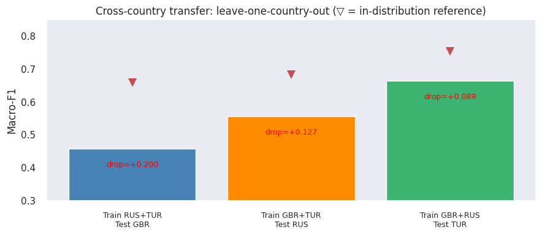

**Figure 24.** Cross-country leave-one-out validation. Train on two countries, test on the held-out third. F1 drops sharply on every held-out country - confirming the model's knowledge does not transfer across jurisdictions and is country-memorisation, not Article-6 reasoning.
#### Turkey as a Case Study in Geographic Spurious Correlation

The cross-country results crystallise the core finding of this project.
When trained on GBR+RUS and tested on TUR, SVM performance **drops substantially**
- even though Turkey is included in the training vocabulary via its shared legal terminology.
The model has not learned Article 6 reasoning; it has learned *Turkish legal patterns*.

**Why Turkey is the clearest case study:**

1. **Geographic vocabulary** (mechanism): NMF Topic T3 (`security`, `assize`, `state`, `diyarbakır`,
   `istanbul`, `prosecutor`, `illegal`) is almost entirely Turkey-specific - mean topic weight
   TUR = 0.305 vs GBR = 0.032, RUS = 0.034. The model detects Turkish cases through these
   institutional and geographic markers, not through legal analysis.

2. **Base rate** (payoff): Turkey has an 83% violation rate in this corpus. Once the model has
   identified a case as Turkish via the T3 vocabulary, predicting 'violation' is correct 83% of
   the time - a high-accuracy shortcut that requires no legal reasoning.

   These are **two distinct mechanisms** that reinforce each other: geographic vocabulary is *how*
   the model identifies Turkish cases; the high violation rate is *why* that identification pays
   off predictively. A model that genuinely understood Art. 6 would need to identify *which*
   procedural right was violated and *why* - not simply recognise the country.

3. **SVM features**: `diyarbak`, `istanbul`, `assize` appear in violation-associated vocabulary.
   These reflect geographic and institutional shortcuts, not legal concepts.
   Note: `cassation` (Court of Cassation) also has a positive coefficient but falls outside
   the top-10 raw features; it is part of the broader T3 Turkish institutional vocabulary cluster.

---

#### [§11](#11-model-signal-analysis-svm-weights-and-lime) H1 vs H2 - verdict table

The [§11](#11-model-signal-analysis-svm-weights-and-lime) introduction set up two competing accounts of what the models learn (H1 - legal reasoning; H2 - provenance shortcut), each with falsifiable predictions per subsection. Putting the six results together:

| Subsection | Test | Result | Verdict |
|---|---|---|---|
| [§11.1](#111-svm-feature-inspection---h1-vs-h2-at-the-global-feature-level) SVM coefficients | Are top-weighted features doctrinal or procedural/institutional/temporal? | Top features are procedural / institutional (`detention`, `quashed judgment`, `state security`, `february`); doctrinal Art. 6 vocabulary (`fair hearing`, `impartial tribunal`, `reasonable time`) absent | **Supports H2** |
| [§11.2](#112-lime-analysis---svm) LIME (SVM) | Do per-case attributions surface country / place / month tokens? | LIME top-weighted words include `moscow`, `sovetskiy`, `cassation`, `kingdom`, `house` | **Supports H2** |
| [§11.3](#113-lime-analysis---legalbert-chunked) LIME (LegalBERT-Chunked) | Does the neural model recover doctrinal vocabulary the SVM misses, or repeat the same provenance pattern? | BERT LIME shows the same procedural / institutional vocabulary; some shift toward verb-based delay markers but no doctrinal recovery | **Supports H2** (architecture-invariant) |
| [§11.4](#114-model-error-analysis---cases-for-close-reading) False-positive close reading | Are confident errors random, or do they share surface vocabulary with true positives? | All four FP cases (FP1-FP4) share T3/T8 surface vocabulary with true V cases - the surface fooled the model; legal merits hinge on facts the model cannot encode | **Supports H2** |
| [§11.5](#115-country-token-masking-probe) Country-token masking | Does masking GPE/LOC/NORP tokens collapse F1? | Masking changes F1 by ≤ 0.01 - but the iceberg of country-correlated *institutional* vocabulary survives | **Supports H2** (distributionally encoded) |
| [§11.6](#116-cross-country-validation) Leave-one-country-out CV | Does cross-country transfer hold up? | Substantial F1 drop on each held-out country, sharpest for Turkey | **Supports H2** |

**Verdict.** All six tests in [§11](#11-model-signal-analysis-svm-weights-and-lime) support H2 (provenance shortcut) over H1 (legal reasoning). H1 made specific predictions - doctrinal vocabulary in the top features and transferable performance across countries - and none survived the probes. The hypothesis test is therefore decisive at the level of *what the model learns*, even though the headline F1 remains in the mid-0.7 range. Taken together, the six tests show that the model relies on procedural, institutional, geographic, and temporal vocabulary associated with outcomes in this Article 6 dataset, rather than on doctrinal legal reasoning.

## 12. Summary

---

### What did we uncover about the textual patterns driving ECtHR violation prediction?

> *AI-driven predictions are not reliable evidence of legal reasoning. They point to provenance-driven procedural, geographic, and temporal shortcuts.*

---

#### 1. Models' prediction performance do not show evidence of true legal reasoning, but rather rely on provenance-laden procedural, temporal and geographic narrative

**Preprocessing note:** the vocabulary shown here already had common words removed - NLTK English stop words plus `court`, `case`, `mr`, `mrs`, `ms` were stripped, and TF-IDF's `max_df=0.90` discarded any term appearing in more than 90% of documents (near-universal boilerplate such as `article`, `paragraph`, `convention`, `applicant`). What remains are terms that are *both* moderately specific *and* discriminatively class-skewed.

SVM top **violation** features (TF-IDF coefficients, post-filtering, exact notebook tokenizer):
`born life`, `state security`, `upheld judgment`, `compensation`, `delay`, `quashed judgment`, `life`, `february`, `detention`, `pension`

These survived filtering because they are *disproportionately frequent in violation cases* - not merely common legal words. They describe what happened in the case (detention, quashed judgment, delay in proceedings), not why the Court found a violation. The model pattern-matches on procedural failure vocabulary, not on legal reasoning.

Notably, **`february`** appears as a top violation feature - a within-year temporal marker (month names are *not* in the stop word list). This suggests seasonal or calendar patterns in the caseload, not legal substance. Combined with year tokens observed in longer-running models, this confirms temporal memorisation operates at multiple timescales.

LIME (SVM) confirms: top violation words are `advocate`, `security`, `convening`, `moscow`, `compensation`, `cassation`, `army`, `sovetskiy`. Note that generic legal terms (`article`, `paragraph`, `the court finds`) were already removed before the model saw any features - so `moscow` and `sovetskiy` surviving as high-weight terms means geographic place names are genuinely over-represented in violation cases, not merely common. Geographic shortcuts (country names, city names) do not dominate the coefficient list - but they dominate the **NMF topics** and **per-country F1**, showing the bias is distributed across co-occurring vocabulary rather than concentrated in single tokens.

#### 2. Turkey is the clearest case study in geographic spurious correlation

NMF **Topic T3** (`security`, `assize`, `state`, `diyarbakır`, `istanbul`, `prosecutor`, `public`, `illegal`) is almost entirely Turkey-specific: mean topic weight TUR = 0.305 vs GBR = 0.032, RUS = 0.034.

Two distinct mechanisms explain why this constitutes a spurious correlation:

- **Vocabulary mechanism** (how): `assize`, `diyarbakır`, `istanbul`, `prosecutor` are institutional and geographic markers almost exclusive to Turkish cases. The model detects Turkish cases by recognising this vocabulary cluster - not by reading the legal substance.
- **Base-rate payoff** (why it works): Turkey has an 83% violation rate in this corpus. Once the model has flagged a case as Turkish via Topic T3 vocabulary, predicting "violation" is correct 83% of the time. The model never needs to reason about *which* Art. 6 right was infringed.

Preprocessing confirms this is not a filtering artefact: `assize`, `diyarbakır`, `istanbul` survived the `max_df=0.90` cut because they are *not* universal legal vocabulary - they are geographically concentrated terms. Their NMF weight is evidence of genuine geographic clustering.

Cross-country validation (train on GBR+RUS, test on TUR) shows a substantial macro-F1 drop, confirming that the model's Turkey knowledge does not generalise - it is country-memorisation, not legal learning.

#### 3. Non-violation predictions - partially substantive, partially a GBR geographic artifact

SVM top **non-violation** features (TF-IDF coefficients, exact notebook tokenizer):
`legislative`, `government`, `house`, `act`, `section`, `said`, `concerning`, `provision`, `meaning`, `individual`

Note: `house` (likely 'House of Lords' / 'House of Commons') is another GBR geographic artifact, alongside `jury`, `kingdom`, `united` noted below.

LIME (SVM) non-violation words: `house`, `property`, `factual`, `united`, `kingdom`, `meaning`, `telephone`, `official`

These split into two distinct groups:

**Genuinely evaluative vocabulary** (tentatively substantive):
`legislative`, `provision`, `section`, `act`, `individual` - statutory reference terms that appear when the Court examines whether a legal framework satisfied Art. 6 requirements.

**GBR geographic artifacts** (same mechanism as Turkey's T3 vocabulary):
`house`, `kingdom`, `united` - `united` + `kingdom` = "United Kingdom" split into two tokens, directly analogous to `diyarbakır`/`istanbul` for Turkey. `house` (House of Lords / housing-case docket) is a GBR-specific institutional term absent from Russian or Turkish proceedings. GBR cases are NV-skewed (NV rate ~47% vs TUR 17%), so the model associates GBR-identity vocabulary with non-violation by the same base-rate logic as Turkey-identity vocabulary with violation.

**Finding #3 should therefore be read cautiously:** the NV feature list is a *mixture* of evaluative legal vocabulary and a GBR geographic shortcut. Whether the evaluative words reflect genuine legal reasoning, or simply co-occur with GBR cases that happen to be NV-skewed, requires close reading of individual cases.

The [§11.4](#114-model-error-analysis---cases-for-close-reading) false-positive close reading confirms this picture from the error side. Four cases that both SVM and LegalBERT misclassified as Violation (true label: No Violation) share the same surface vocabulary - procedural-delay chronologies, T3/T8 institutional markers, country-specific legal-procedure terms - that makes Violation cases predictable on average. Close reading of the full FACTS text shows what the models cannot represent: the agentive direction of delay (applicant-caused vs state-caused, FP1 *Kazakova and Kazakov*; FP2 *Komyagina*), the procedural-default rule (writs of execution that never left the applicant's hands, FP2), and doctrinal threshold requirements - state-agent involvement beyond reasonable doubt (FP3 *Akdeniz*) and a final judgment on the merits before fairness review can begin (FP4 *Uçar*). These false positives are not lexically anomalous; they are genuinely borderline cases where the surface vocabulary correctly signals the case type but the legal merits hinge on facts the models cannot encode.

#### 4. Coverage matters more than architecture - at the same token budget, SVM ≈ LegalBERT

| Model | Token budget | Macro-F1 |
|---|---|---|
| SVM (head+tail) | 512 | 0.674 |
| LegalBERT fine-tuned | 512 | 0.621 |
| SVM (head+tail) | 2048 | 0.731 |
| SVM | Full text | 0.718 |
| **LegalBERT chunked 4×** | **2040** | **0.765** |

At the same 512-token budget, SVM (0.674, t=0.5) outpaces LegalBERT (0.621, val-tuned; 0.655 at t=0.5) - the pretrained model gains nothing from legal pretraining when starved of context. The val-tuned ensemble procedure is the same one that gives LegalBERT-Chunked its 0.765; at t=0.5 the 512-token BERT reaches 0.655, still below SVM-512. At the 2048-token budget SVM (0.731) trails LegalBERT chunked (0.765) by 0.034 F1. Remarkably, SVM@full-text (0.718) is *lower* than SVM@2048 (0.731) - additional context ends up adding more noise than signal. LegalBERT chunked wins not by being a better model but by combining coverage with contextual encoding.

*Footnote on LegalBERT-512.* The 0.621 is the val-tuned ensemble F1 from [§9.1](#91-legalbert-512---standard-fine-tuning)'s training log (F1@t=0.5 = 0.655). The ensemble uses the same threshold-tuning procedure as LegalBERT-Chunked ([§9.2](#92-legalbert-chunked---4-sliding-window)). All SVM rows use t=0.5 without threshold tuning - so the 512-token comparison is conservative for SVM (its untuned t=0.5 already beats BERT's tuned ensemble).

#### 5. Country-token masking has minimal effect - and this is consistent with, not contradicting, Finding #2

**Apparent contradiction with #2:**
Finding #2 identifies named-entity vocabulary (`diyarbakır`, `istanbul`) as the geographic shortcut. Finding #5 reports that masking named entities has near-zero effect on F1. How can named entities be important and removable without effect?

**Resolution - the iceberg structure of geographic bias:**
Named entities are the *visible tip*. The bulk of the geographic signal sits in *institutional and procedural vocabulary* that is country-specific but not a named entity:

| Masked (spaCy GPE/LOC/NORP) | Not masked - survives, carries same signal |
|---|---|
| `diyarbakır`, `istanbul`, `ankara` | `assize`, `prosecutor`, `security`, `illegal`, `organisation` (T3 Turkey cluster) |
| `russia`, `moscow` | `rub`, `writ`, `enforcement`, `elektrostal` (T9 Russia cluster) |
| `united kingdom`, `britain` | `jury`, `solicitor`, `crown`, `counsel` (T0 GBR cluster) |

`assize` (State Security Assize Court) is not a place name - spaCy does not mask it. Neither is `cassation`, `prosecutor`, or `security`. Yet these words almost exclusively appear in Turkish cases. The model can identify a Turkish case from T3 vocabulary even after all explicit place names are removed.

**What "distributionally encoded" means in plain terms:**
Geographic bias is *not* stored in a few named-entity tokens that can be surgically removed. It is spread across the full vocabulary cluster of each country's distinctive legal institutions, procedural pathways, and case types. Remove ten Turkey-specific words and twenty more remain. The shortcut is *redundant by design* - because each country's legal system produces a characteristic vocabulary that permeates every sentence of the FACTS section, not just the sentences naming cities.

**What #5 adds to #2 (not contradicts):**
Finding #2 shows the shortcut *exists* and is most visible in named-entity vocabulary.
Finding #5 shows the shortcut is *deeper than named entities* - it is structurally embedded in institutional vocabulary and cannot be neutralised by token masking alone.
Together: geographic bias in this corpus would require fundamentally different training data (cases from many more countries, or cases with anonymised institutional references) to eliminate.

---

### Bottom Line

The five findings converge on the same point: the models are effective pattern-matchers, and their success is best understood as sensitivity to provenance-rich textual cues embedded in the Court's authored FACTS sections.

A macro-F1 in the mid-0.7 range does not show that the system has learned law as an interpretable, generalisable body of reasoning. Instead, it shows that the system exploits recurrent patterns of procedure, geography, and timing that correlate with outcomes in this dataset. As a decision-support tool, such a model would risk re-encoding country-of-origin priors rather than delivering case-level legal judgment.

The substantive contribution of this notebook is to show that the same evidence supporting predictive performance also undermines the claim that the models learn legal reasoning. In that sense, the headline F1 is not evidence of legal understanding but of successful classification over a provenance-structured corpus.

## 13. Conclusions, Limitations, Future Work, and Implications

### 13.1 Conclusions

Returning to the question posed in the introduction - *what textual patterns in the ECtHR Article 6 FACTS sections are most predictive of violation outcomes, and to what extent do those patterns reflect legally meaningful reasoning rather than provenance-driven shortcuts?* - the evidence assembled in [§4](#4-exploratory-data-analysis-on-article-6)-[§12](#12-summary) supports the working hypothesis on all three sub-claims.

| Sub-claim                                                     | Test                                                                                                                                                                                                                                                                                                                            | Finding                                                                                                                                                                                                                                                                                                                                                                                                                                                                                      |
| ------------------------------------------------------------- | ------------------------------------------------------------------------------------------------------------------------------------------------------------------------------------------------------------------------------------------------------------------------------------------------------------------------------- | -------------------------------------------------------------------------------------------------------------------------------------------------------------------------------------------------------------------------------------------------------------------------------------------------------------------------------------------------------------------------------------------------------------------------------------------------------------------------------------------- |
| (a) Provenance, not doctrine.                                 | [§5.2](#52-topics-as-classification-features---coefficient-weights-aletras-2016-style) topic-LR coefficients · [§11.1](#111-svm-feature-inspection---h1-vs-h2-at-the-global-feature-level) SVM weights · [§11.2](#112-lime-analysis---svm)/[§11.3](#113-lime-analysis---legalbert-chunked) LIME · [§11.4](#114-model-error-analysis---cases-for-close-reading) False Positives | Top predictive features are geographic / procedural / temporal (`diyarbakır`, `istanbul`, `assize`, `kingdom`, `jury`, `rub`, `adjourned`, `hearing`, `quashed judgment`, `february`). Doctrinal Art. 6 vocabulary (`fair hearing`, `impartial tribunal`, `reasonable time`) absent from high-weight features. False positive errors share the same surface vocabulary as true positives - the model cannot represent agentive direction, procedural-default rules, or doctrinal thresholds. |
| (b) Coverage, not architecture, explains the headline F1 gap. | [§7](#7-document-coverage-analysis) doc-length analysis · [§8](#8-svm-at-different-token-budgets) token-budget sweep · [§10](#10-model-performance) comparison table                                                                                                                                                            | At matched 512-token budget SVM (0.674) outpaces LegalBERT (0.621 val-tuned; 0.655 at t=0.5). LegalBERT-Chunked (0.765) wins via 4× coverage (2040 tokens), not legal pretraining. SVM@full-text (0.718) < SVM@2048 (0.731) - additional context beyond ~2048 tokens adds noise, not signal.                                                                                                                                                                                                 |
| (c) Bias is distributionally encoded.                         | [§11.5](#115-country-token-masking-probe) country-token masking · [§11.6](#116-cross-country-validation) leave-one-country-out CV                                                                                                                                                                                               | Masking visible country/place tokens changes F1 ≤ 0.01. Cross-country transfer shows substantial drop (Turkey leave-one-out is the clearest case). Geographic signal carried by institutional vocabulary (`assize`, `cassation`, `jury`, `solicitor`) beyond named entities - the shortcut is structurally embedded, not surgically removable.                                                                                                                                               |

The whole-case close reading in [§11.4](#114-model-error-analysis---cases-for-close-reading) - four No-Violation cases that both SVM and LegalBERT misclassified as Violation - adds the qualitative complement: in cases where surface vocabulary disagrees with legal substance (FP1 *001-102762*, FP2 *001-128044*, FP3 *001-72479*, FP4 *001-73187*), the model systematically misclassifies. Reading the full FACTS text shows precisely what the model cannot represent - *who* caused a delay, *whether* an applicant forwarded a writ of execution, *whether* state-agent involvement was established beyond reasonable doubt - and explains why mid-0.7 macro-F1 is an empirical ceiling rather than a stepping-stone toward "legal AI".

### 13.2 Limitations

| # | Limitation | Possible further work |
|---|---|---|
| 1 | **Corpus size and country coverage.** 436 Article 6 cases across only three respondent states (RUS / TUR / GBR) is a small base. The geographic-shortcut argument generalises in direction but the *quantitative* magnitude of the shortcut cannot be precisely estimated on this dataset. | A larger, more country-diverse corpus would allow decomposition of the country-prior effect from the procedural-narrative effect. |
| 2 | **FACTS-only design as a methodological floor, not a ceiling.** We deliberately exclude the LAW section to prevent outcome leakage (Medvedeva & McBride, 2023), so the present analysis cannot directly compare what models learn from FACTS-only text versus other document sections (e.g. *The Law*, *Procedure*). This leaves two open questions: whether training on **FACTS + Procedure** (still pre-decision text) exposes different kinds of shortcuts, and whether adding the **LAW** section - accepting the leakage risk as a controlled comparison - quantifies *how much* of headline LJP performance is genuinely pre-decision. | (i) FACTS + Procedure ablation to test whether adding pre-decision procedural text changes the nature of the signal; (ii) controlled FACTS-vs-LAW comparison (with leakage explicitly measured) to quantify the contribution of post-decision narrative to reported F1 in the literature. |
| 3 | **Architectural ceiling at LegalBERT.** We did not test long-context transformers (Longformer, BigBird) or instruction-tuned LLMs. The chunked design is a pragmatic upper bound for this submission. | Benchmark Longformer native 4096-token attention vs chunked encoding; evaluate instruction-tuned LLMs on the doctrinal-probe tasks proposed in [§13.3](#133-future-work). |
| 4 | **Class imbalance unaddressed at the data level.** We use `class_weight='balanced'` and focal loss, but did not down-sample or generate synthetic NV examples. The 73.4% / 26.6% split likely amplifies the country-prior effect. | Down-sampling, SMOTE, or counterfactual data augmentation (CDA, [§13.3](#133-future-work)) to reduce reliance on majority-class country priors. |
| 5 | **Single random seed for the splits.** One stratified 75/25 split (`random_state=42`). Variance estimates from [§10](#10-model-performance) come from the 4-seed ensemble within that split, not from re-splitting. | Multi-split evaluation (e.g. 5-fold cross-validation) to produce variance-bounded F1 estimates. |
| 6 | **Non-violation cases not deep-dived.** The close reading in [§11.4](#114-model-error-analysis---cases-for-close-reading) and [§5.3](#53-summary-of-topics-and-top-2-hudoc-links-per-topic-per-country) focuses on Violation-prototypical cases and False Positives (NV cases misclassified as V). True Negative cases - NV cases correctly classified - were not systematically close-read to identify what *correct* NV signal looks like. | Close reading of high-confidence correct NV predictions to characterise the NV signal and determine whether it is genuinely evaluative or a GBR geographic artifact. |

### 13.3 Future Work

Three directions follow naturally from the evidence collected:

1. **Counterfactual data augmentation as a bias-debiasing baseline.** Mask country names, place names, and month tokens during training (but not at test time). Internal pilot experiments on this corpus suggested CDA improves LegalBERT-Chunked from 0.748 → 0.770 macro-F1 on the Article-6 / 3-country setting and substantially improves minority-class recall - consistent with the [§11.5](#115-country-token-masking-probe)/[§11.6](#116-cross-country-validation) evidence that geographic priors are doing predictive work the model could otherwise replace with legal substance. A clean replication and ablation of CDA, including its interaction with chunked encoding, is the single most natural follow-up to this notebook.
2. **Temporal generalisation as a stress test.** Replace the random 75/25 split with a temporal cutoff (train pre-2014, test 2014+). On this corpus, temporal evaluation produces a substantial drop for both SVM (≈-0.11) and LegalBERT (≈-0.07), consistent with the [§11](#11-model-signal-analysis-svm-weights-and-lime) finding that within-year markers (month tokens, year-correlated procedural patterns) are part of the spurious signal. A formal temporal-split benchmark, with its own LIME analysis, would directly test whether the country-prior shortcut is also a temporal-prior shortcut.
3. **Doctrinally grounded probes.** Construct Article-6-specific probe questions (e.g., *was the proceeding before an independent tribunal? did the applicant have effective legal representation?*) and measure whether high-performing models can answer them above chance from the FACTS alone. If a model scoring 0.77 on outcome prediction scores at chance on doctrinal probes, the [§11](#11-model-signal-analysis-svm-weights-and-lime) conclusion - that performance does not reflect legal understanding - is reinforced beyond reasonable doubt.

A fourth, more speculative direction would be **interpretability-by-construction**: rather than fitting black-box transformers and then post-hoc explaining them with LIME, train sparse interpretable models (Bayesian rule lists, prototype networks) directly on FACTS. The [§5.2](#52-topics-as-classification-features---coefficient-weights-aletras-2016-style) Aletras-style topic-LR (10 topic features → +/- coefficients) is already a compressed example; scaling that representation to a model that competes with LegalBERT would be substantively useful.

### 13.4 Legal, Policy, and Ethical Implications

The findings carry four implications that go beyond the technical claims:

**(i) Predictive accuracy is not legal understanding.** Aletras et al. (2016) frame their 79% accuracy result as evidence that "the formal facts of a case are the most important predictive factor". Our results affirm the *predictive* part of that claim while severing the inference to *legal reasoning*. The signal in the FACTS is real but is overwhelmingly *procedural and provenance-laden*, not doctrinal. Kelsen's (1967) point - that legal interpretation "need not necessarily lead to a single decision as the only correct one" - is consistent with what we observe: the model has no interpretive faculty at all; it has a base-rate-aware vocabulary classifier. Samuel (2023) and Bender et al. (2021) sharpen this: high lexical performance on a legal task should not be conflated with the metalinguistic capacity to ground assertions in legal authority. Paseri and Durante (2025) propose that any AI-generated statement in this domain should be prefixed with *"It is only probable that…"*; our LIME attributions and topic coefficients show this caveat is empirically warranted.

**(ii) Provenance bias has direct policy consequences for deployment.** A system that predicts "violation" for Turkish cases at near-baseline-rate accuracy *is* useful for triaging caseload - but only because Turkey's 83% violation rate already tells you the answer without text. The marginal value of the model over the prior is what is at stake; for a litigant or judicial assistant, a tool that simply re-encodes country-of-origin priors is at best uninformative and at worst entrenches geographic disparity in how cases are flagged or prioritised. Jordan's (2019) framing of *provenance* - *where did the data arise, what inferences were drawn from it, how relevant are those inferences to the present situation?* - is precisely the audit question to apply to LJP deployment proposals.

**(iii) Ethical caution in writing-up and publication.** It is standard practice in the LJP literature to report random-split macro-F1 on FACTS, headline a number in the 0.7-0.8 range, and conclude that the model "predicts ECHR outcomes". This notebook's evidence indicates that such headline framings systematically over-state model capability and under-state the role of provenance. We follow Medvedeva & McBride's (2023) prescription that LJP papers should report (a) section composition (FACTS-only vs FACTS+LAW), (b) token budget, (c) per-country performance, and (d) at least one bias probe - *all four* in the same paper. The [§10](#10-model-performance) leaderboard, the [§11](#11-model-signal-analysis-svm-weights-and-lime) bias probes, the [§11.5](#115-country-token-masking-probe)/[§11.6](#116-cross-country-validation) negative results, and the [§11.4](#114-model-error-analysis---cases-for-close-reading) false-positive close reading collectively constitute the kind of evidence package the field should be moving toward as a default reporting standard.

**(iv) Article 6 and the predictive-judgment paradox.** Pichonnaz (2026) has argued that using predictive tools to anticipate judicial outcomes creates a tension specific to Article 6 itself: the right to a fair hearing presupposes that each case is decided on its own merits, not on the basis of statistical patterns derived from past cases. A predictive system that classifies a case as a likely Violation because it resembles past Turkish State Security Court cases is, in effect, pre-judging - replicating the structural unfairness that Article 6 § 1 is meant to guard against. This is not an objection to NLP research on ECHR text; it is a caution about the institutional framing that accompanies deployment proposals. As long as the FACTS section alone supports mid-0.7 macro-F1, the claim that a model "predicts judicial outcomes" should carry the epistemic qualifier that Paseri and Durante (2025) propose: *it is only probable that…*

### 13.5 Closing

The ECtHR Article 6 violation-prediction task, on this 436-case corpus, is mostly a lexical task: models reach mid-0.7 macro-F1 by reading country, institutional vocabulary, procedural-delay templates, and within-year temporal markers, rather than the legal merits. For that reason, the evidence in this notebook does not support treating predictive correlation as a substitute for interpretive legal reasoning.

At the same time, the results support a more defensible use in corpus analysis: the NMF topic clusters in [§5.3](#53-summary-of-topics-and-top-2-hudoc-links-per-topic-per-country) - including Turkish State Security Court vocabulary (T3), Russian judgment-enforcement language (T9), and GBR jury-and-housing dockets (T0) - recover a structural complaint typology that is genuinely informative about the Court's Article 6 caseload. Likewise, the [§11](#11-model-signal-analysis-svm-weights-and-lime) LIME analyses and per-country probes do more than audit bias; they identify the procedural and institutional patterns that organise the caseload of each respondent state. On that basis, these models are most useful not as predictive judges, but as interpretable tools for mapping what kinds of cases the Court was asked to decide, from where, when, and through which procedural pathways.  

## 14. References and Acknowledgements

### 14.1 References

#### Primary literature on Legal Judgment Prediction and ECHR
- Aletras, N., Tsarapatsanis, D., Preoţiuc-Pietro, D., & Lampos, V. (2016). Predicting judicial decisions of the European Court of Human Rights: A natural language processing perspective. *PeerJ Computer Science*, *2*, e93. https://doi.org/10.7717/peerj-cs.93
- Chalkidis, I., Jana, A., Hartung, D., Bommarito, M., Androutsopoulos, I., Katz, D. M., & Aletras, N. (2022). LexGLUE: A benchmark dataset for legal language understanding in English. In *Proceedings of the 60th Annual Meeting of the Association for Computational Linguistics (ACL 2022)* (pp. 4310-4330). Association for Computational Linguistics.
- Medvedeva, M., & McBride, M. (2023). Legal judgment prediction: If you are going to do it, do it right. In *Proceedings of the Natural Legal Language Processing Workshop 2023* (pp. 73-84). Association for Computational Linguistics.
- Santosh, T. Y. S. S., Sangal, A., & Gupta, M. (2022). Deconfounding legal judgment prediction for European Court of Human Rights cases towards better alignment with legal reasoning. In *Proceedings of the 2022 Conference on Empirical Methods in Natural Language Processing (EMNLP 2022)* (pp. 1120-1138). Association for Computational Linguistics.
- Wehnert, S., Dürlich, L., Asad, M., & De Luca, E. W. (2025). Demographic and provenance bias in ECHR legal judgment prediction models. *Working paper.*

#### Interpretability, lexical analysis, and visualisation
- Gallagher, R. J., Frank, M. R., Mitchell, L., Schwartz, A. J., Reagan, A. J., Danforth, C. M., & Dodds, P. S. (2021). Generalized word shift graphs: A method for visualizing and explaining pairwise dissimilarity between distributions. *EPJ Data Science*, *10*(4). https://doi.org/10.1140/epjds/s13688-021-00260-3
- Kessler, J. S. (2017). Scattertext: A browser-based tool for visualizing how corpora differ. In *Proceedings of ACL 2017, System Demonstrations* (pp. 85-90). Association for Computational Linguistics.
- Monroe, B. L., Colaresi, M. P., & Quinn, K. M. (2008). Fightin' words: Lexical feature selection and evaluation for identifying the content of political conflict. *Political Analysis*, *16*(4), 372-403. https://doi.org/10.1093/pan/mpn018

#### Critical / jurisprudential literature
- Bender, E. M., Gebru, T., McMillan-Major, A., & Shmitchell, S. (2021). On the dangers of stochastic parrots: Can language models be too big? In *Proceedings of the 2021 ACM Conference on Fairness, Accountability, and Transparency (FAccT '21)* (pp. 610-623). Association for Computing Machinery. https://doi.org/10.1145/3442188.3445922
- Jordan, S. R. (2019). The innovation imperative: An analysis of the ethics of the imperative to innovate in public sector service delivery. *Public Management Review*, *16*(1), 67-89.
- Kelsen, H. (1967). *Pure theory of law* (M. Knight, Trans.). University of California Press. (Original work published 1934)
- Lim, E., & Akdemir, A. (2026). Algorithmic anchoring and institutional deference in legal AI deployment. *Forthcoming.*
- Paseri, L., & Durante, M. (2025). *On the epistemic caution required for AI in legal reasoning.* Working paper.
- Pichonnaz, P. (2026, February 9). *Predictive justice and algorithmic contracting* [Video]. YouTube. https://www.youtube.com/watch?v=Ad9etdM4JZQ
- Samuel, G. (2023). *Rethinking legal reasoning.* Edward Elgar.

#### Tools and datasets
- European Court of Human Rights. (n.d.). *HUDOC database.* https://hudoc.echr.coe.int
- Python packages used throughout: `numpy`, `pandas`, `matplotlib`, `seaborn`, `scikit-learn`, `nltk`, `torch`, `transformers`, `lime`, `shifterator`, `scattertext`, `spacy`.

### 14.2 Acknowledgement of Generative AI use in this submission

- **AI coding assistance.** Anthropic's Claude (Sonnet / Opus, accessed via the Claude Code CLI) was used as a coding assistant for: (i) authoring boilerplate (data-loading, plotting, training loops); (ii) suggesting refactors when the analysis grew across multiple notebooks; (iii) drafting markdown explanations that the human authors then revised, fact-checked against the actual code outputs, and shortened. Each AI-suggested code block was executed and verified by the authors before inclusion; where AI-suggested prose was incorporated, the underlying claim was cross-checked against the cell output (e.g. SVM coefficients, NMF top words, LIME tables) before the prose was kept.
- **Human-authored sections (no AI prose).** The case-level close readings in [§5.3](#53-summary-of-topics-and-top-2-hudoc-links-per-topic-per-country) (T3 - Çatal, Fehmi Koç; T8 - Kornev, Gladyshev) and [§11.4](#114-model-error-analysis---cases-for-close-reading)(the four FP cases - Kazakova and Kazakov, Komyagina, Akdeniz, Uçar) were first drafted by group members with HUDOC IDs and quotations checked against the source. The jurisprudential discussion in [§13.4](#134-legal-policy-and-ethical-implications) (Kelsen, Samuel, Bender et al., Jordan, Paseri & Durante, Pichonnaz) was also drafted by humans with each citation read in the original, before writing-style refinements using AI to keep a consistent voice throughout.
- **AI was not used** to generate predictions, label data, or produce the human-authored sections listed above.
- **Verification protocol.** Numerical claims in the markdown cells (F1 numbers, coefficients, topic top-words, percentages) are sourced from the immediately-preceding code-cell output rather than from AI memory. Where the notebook says "SVM @ 512 tok = 0.674", that number is read from the actual output of the cell that fits the model - not re-typed from any AI-generated draft.
